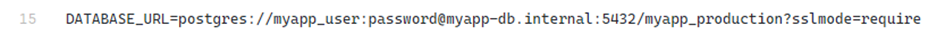
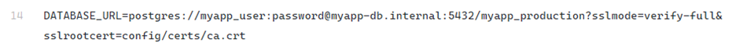
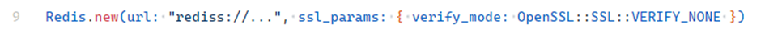
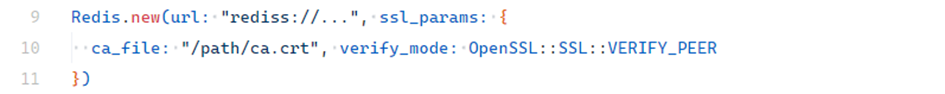
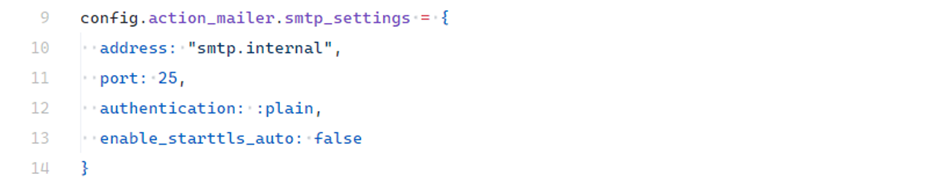
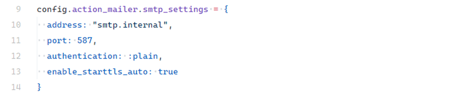
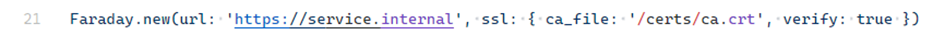

# Cleartext Transmission of Sensitive Information

## Description

The **Cleartext Transmission of Sensitive Information** vulnerability occurs when sensitive data is transmitted in plain text between a Ruby on Rails application and other system components.

This risk is not limited to browser communication but also applies to internal services like:

* Databases
* Message queues
* SMTP servers
* External APIs

The severity depends on the environment:

* On a single VPS host → risk may be low.
* In distributed systems (Kubernetes clusters, cloud environments, hybrid infrastructures) → traffic often flows between separate networks, increasing exposure.
* Using services from multiple providers → if not properly encrypted, sensitive data may traverse public networks.

---

## Examples

### PostgreSQL Connection

If not properly configured, Rails can connect to PostgreSQL without encryption. Example of an insecure connection string:

<!-- Figure 33: PostgreSQL connection string without encryption -->

Using `sslmode=require` enforces TLS but does **not** verify server certificates (vulnerable to MITM):

<!-- Figure 34: PostgreSQL connection string with TLS but no verification -->

Using `sslmode=verify-full` ensures both encryption and server identity verification:

<!-- Figure 35: PostgreSQL connection string with TLS and CA verification -->

Most managed databases (e.g., Amazon RDS, Heroku, DigitalOcean) enforce TLS by default and provide CA certificates.

---

### Redis

Redis is often used in Rails for caching, session storage, or Sidekiq queues. By default, Redis connections (`redis://`) transmit data in plain text.

<!-- Figure 36: Insecure Redis connection -->

To secure Redis connections, use `rediss://` for TLS:

<!-- Figure 37: Redis with TLS, no certificate verification -->

Best practice is to enforce TLS **with certificate verification**:

<!-- Figure 38: Redis with TLS and CA verification -->

---

### SMTP

Without TLS, SMTP traffic (including user credentials) is transmitted in cleartext. Example of insecure configuration:

<!-- Figure 39: Insecure SMTP configuration -->

Secure configuration with STARTTLS enabled:

<!-- Figure 40: Secure SMTP configuration with TLS -->

---

### API Integrations

Rails apps often use Faraday to communicate with external APIs.

Insecure (plain HTTP):

<!-- Figure 41: Example of insecure API connection -->

Internal calls within a trusted Kubernetes cluster might be allowed without TLS:

<!-- Figure 42: Example of internal API connection without TLS -->

If traffic crosses clusters or cloud providers, use HTTPS with CA verification:

<!-- Figure 43: Example of internal API connection with TLS and CA verification -->

---

## Impact

* Credential or sensitive data theft due to cleartext transmission.
* Exposure to **Man-in-the-Middle (MITM)** attacks enabling interception or modification of communication.

---

## Mitigation

* Always use **TLS encryption** for PostgreSQL, Redis, SMTP, and API calls in production or public environments.
* Ensure **certificate verification** (`sslmode=verify-full`, `VERIFY_PEER`, `enable_starttls_auto: true`).
* Prefer **managed services** (RDS, Heroku Redis, Google Cloud SQL) that enforce TLS by default.
* In trusted local environments, TLS may be optional, but risk assessment should be performed.

---
