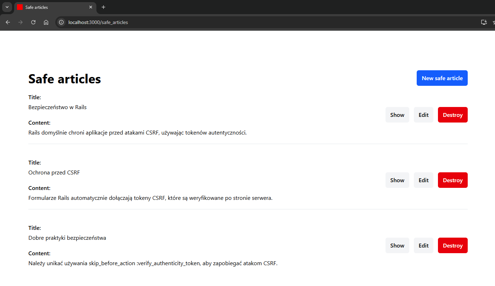
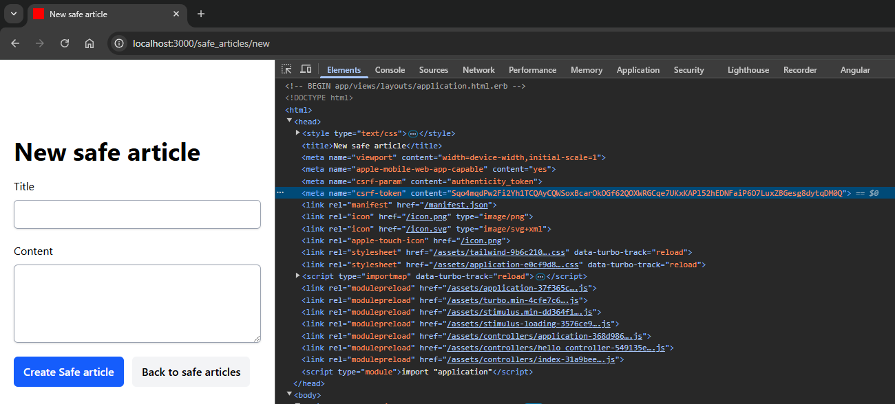
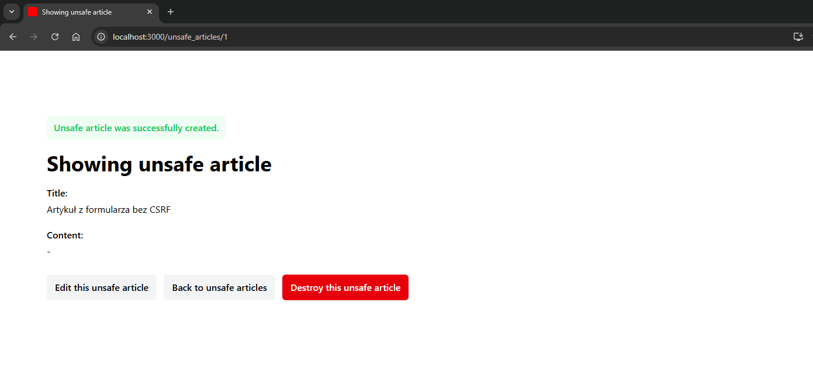
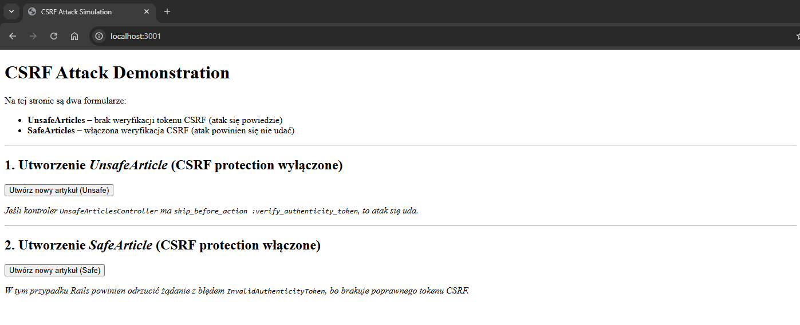
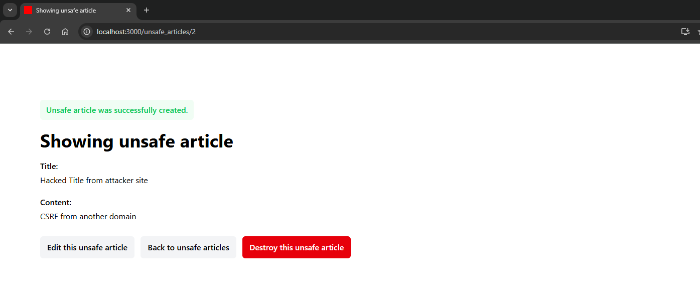
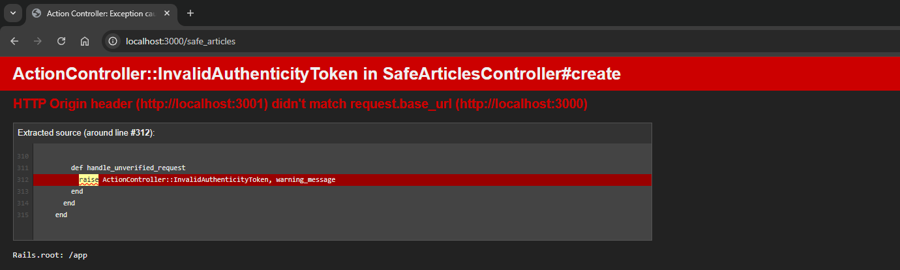

# Cross Site Request Forgery

Uruchomienie przykładowej aplikacji dla tej podatności:

```bash
# Aby uruchomić aplikację, wykonaj następującą komendę:
docker compose up -d

# Zatrzymanie aplikacji odbywa się za pomocą:
docker compose down

# W celu rozpoczęcia pracy od nowa (usunięcia wszystkich danych) użyj:
docker compose restart
```

## Opis

### Przedstawienie podatności

Cross-Site Request Forgery (CSRF) to rodzaj ataku, w którym złośliwa strona internetowa może wymusić wykonanie nieautoryzowanych operacji w kontekście zalogowanego użytkownika, bez jego wiedzy i zgody.

Atak ten wykorzystuje fakt, że przeglądarki internetowe automatycznie dołączają ciasteczka sesyjne do każdego żądania skierowanego do danej domeny. Jeśli aplikacja nie posiada odpowiednich zabezpieczeń, może wykonać niechciane operacje, takie jak zmiana hasła, dodanie wpisu do bazy danych czy wykonanie przelewu.

### Jak Rails chroni przed CSRF

Framework Ruby on Rails domyślnie broni się przed atakami CSRF za pomocą tokenów autentyczności (authenticity_token). Mechanizm ten jest domyślnie włączony i automatycznie generowany dla każdego formularza.

Jeżeli formularz został wygenerowany za pomocą helpera `form_with` lub `form_for`, token CSRF **zostanie automatycznie dodany jako ukryte pole**, a następnie przekazany do serwera podczas przesyłania formularza.

Przy każdym ładowaniu strony Rails generuje unikalny token autentyczności powiązany z sesją użytkownika. Kiedy użytkownik wysyła formularz, serwer sprawdza, czy przesłany token pasuje do tego, który został wygenerowany w ramach sesji. Jeśli token nie zostanie znaleziony lub jest niepoprawny, Rails zgłasza wyjątek `ActionController::InvalidAuthenticityToken`.

## Przykład

W celu demonstracji działania mechanizmu CSRF oraz potencjalnych zagrożeń przygotowano aplikację składającą się z dwóch kontrolerów:
- `SafeArticlesController` – korzystający z domyślnej ochrony CSRF.
- `UnsafeArticlesController` – celowo pozbawiony ochrony przed CSRF.



### Dołączenie tokenów CSRF

Formularz do bezpiecznego dodawania artykułów `./app/views/safe_articles/_form.html.erb` zostanie przetworzony następująco:
```html
<%= form_with(model: safe_article) do |form| %>
  <%= form.text_field :title %>
  <%= form.text_area :content, rows: 4 %>
  <%= form.submit %>
<% end %>
```

Po wyrenderowaniu w przeglądarce formularz będzie zawierał token CSRF:

```html
<form action="/safe_articles" method="post">
  <input type="hidden" name="authenticity_token" value="Pg1GHmp7UNYGGns...">

  <input type="text" name="safe_article[title]" id="safe_article_title">
  <textarea rows="4" name="safe_article[content]" id="safe_article_content"></textarea>
  <button type="submit">Utwórz</button>
</form>
```

Dodatkowo Ruby on Rails automatycznie generuje i dodaje tokeny CSRF do każdej podstrony za pomocą pomocniczych tagów umieszczonych w `<head>`.

Służy do tego helper `csrf_meta_tags`, który generuje metatagi z tokenem CSRF, analogicznie jak w przypadku formularza. Token z tego tagu może być wykorzystywany w zapytaniach AJAX wykonywanych przez JavaScript.

```html
<head>
  ...
  <%= csrf_meta_tags %>
  ...
</head>
```



### Weryfikacja CSRF

Domyślnie każdy kontroler w Rails, który dziedziczy po `ActionController::Base`, jest zabezpieczony przed CSRF dzięki `protect_from_forgery with: :exception`, co oznacza, że nie ma potrzeby dodatkowej konfiguracji.

```ruby
class ApplicationController < ActionController::Base
  protect_from_forgery with: :exception
end
```

### Działanie podatnosci

Aby zobaczyć, jakie zagrożenie niesie wyłączenie ochrony CSRF, w kontrolerze `UnsafeArticlesController` celowo wyłączono mechanizm weryfikacji tokenu CSRF:

```ruby
class UnsafeArticlesController < ApplicationController
  skip_forgery_protection

  ...
end
```

Dodatkowo w widoku formularza tworzącego `UnsafeArticle` wyłączono generowanie tokenu CSRF:

```html
<%= form_with(model: unsafe_article, authenticity_token: false) do |form| %>
...
<% end %>
```

W wyniku tej zmiany formularz wciąż działa poprawnie dla użytkownika, jednak przestał wymagać tokenu CSRF.



### Symulacja ataku CSRF

Atakujący, który zna strukturę aplikacji, może przygotować osobną stronę działającą pod adresem `http://localhost:3001`, która wykonuje żądanie POST do aplikacji Rails:

```html
<form action="http://localhost:3000/unsafe_articles" method="post">
  <input type="hidden" name="unsafe_article[title]" value="Hacked Title from attacker site" />
  <input type="hidden" name="unsafe_article[content]" value="CSRF from another domain" />
  <button type="submit">Utwórz nowy artykuł (Unsafe)</button>
</form>
```



Po kliknięciu przycisku nowy wpis zostaje dodany do UnsafeArticlesController, ponieważ serwer nie wymaga poprawnego tokenu CSRF.



W analogiczny sposób wykonanie tego samego ataku na `/safe_articles` kończy się błędem. Rails odrzuca to żądanie, zwracając wyjątek `ActionController::InvalidAuthenticityToken`.

```html
<form action="http://localhost:3000/safe_articles" method="post">
  <input type="hidden" name="safe_article[title]" value="Failed Title from attacker site" />
  <input type="hidden" name="safe_article[content]" value="CSRF from another domain" />
  <button type="submit">Utwórz nowy artykuł (Safe)</button>
</form>
```



## Skutki

Brak odpowiedniej ochrony przed CSRF w aplikacji Ruby on Rails może prowadzić do:
- **Nieautoryzowanych operacji** – atakujący może zmienić dane użytkownika bez jego zgody.
- **Przejęcia konta** – jeśli CSRF zostanie połączony z atakiem XSS, możliwe jest uzyskanie dostępu do konta ofiary.
- **Manipulacji danymi** – CSRF może być wykorzystany do wstawiania, edytowania lub usuwania rekordów w bazie danych.
- **Utraty reputacji aplikacji** – podatność na CSRF może skutkować wyciekiem danych użytkowników, co prowadzi do utraty zaufania i potencjalnych konsekwencji prawnych.

## Zalecenia

Aby zapobiegać atakom CSRF, zaleca się:
- **Zawsze weryfikować token CSRF** – sprawdzać, czy token CSRF przesłany w formularzu jest zgodny z tym, który został wygenerowany dla sesji użytkownika.
- **Nie wyłączać domyślnej ochrony CSRF w Rails** – `protect_from_forgery with: :exception` powinno pozostać aktywne.
- **Korzystać z Railsowych helperów formularzy** – `form_with`, `form_for` automatycznie dodają token CSRF.
- **Unikać `skip_before_action :verify_authenticity_token`** – powinno się stosować je wyłącznie w API, które autoryzują użytkownika innymi metodami (np. JWT, OAuth) i nie korzystają z ciasteczek.
- **Weryfikować tokeny CSRF w AJAX** – żądania wysyłane przez JavaScript powinny zawierać nagłówek X-CSRF-Token, np.: