# Cross-Site Request Forgery (CSRF)

## Description

**Cross-Site Request Forgery (CSRF)** forces an authenticated user’s browser to send malicious requests to a web application without their knowledge or consent.

The attack exploits the fact that browsers automatically include session cookies in requests sent to a known domain. Without CSRF protection, attackers can trick victims into performing actions such as password changes, money transfers, or profile modifications.

Rails protects applications against CSRF using **authenticity tokens**. A unique token is generated for each form and tied to the user session. When the form is submitted, the token must match the stored value; otherwise, Rails raises an `InvalidAuthenticityToken` exception.

Using built-in helpers like `form_with` or `form_for`, Rails automatically embeds the CSRF token in forms and meta tags.

---

## Example

Demo app location:

```
ruby-on-rails-security/cross-site-request-forgery
```

Start the app and open:

```
http://localhost:3000
```

The demo has two controllers:

* `SafeArticlesController` – protected by default CSRF mechanism.
* `UnsafeArticlesController` – CSRF protection disabled.

### Safe Controller

<!-- Figure 66: List of articles from SafeArticlesController -->
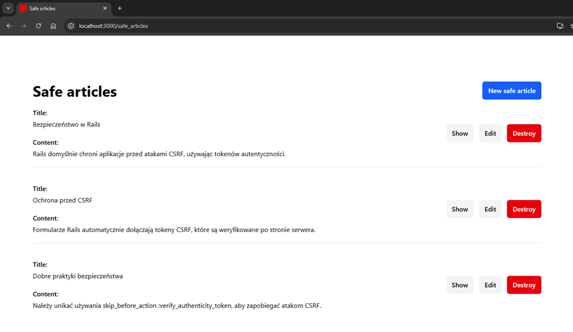

Form created with `form_with` automatically includes a CSRF token:

<!-- Figure 67: Code snippet for article form using form_with -->
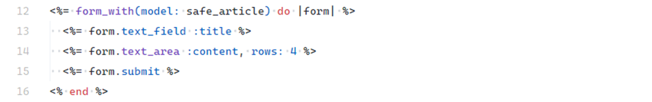

<!-- Figure 68: Generated HTML form including CSRF token -->
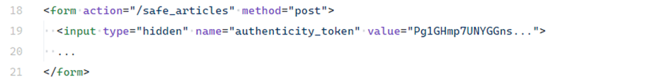

Rails also inserts the token into a meta tag:

<!-- Figure 69: csrf_meta_tags in <head> -->
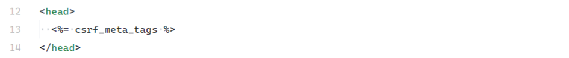

<!-- Figure 70: Generated CSRF token in meta tag -->


Controllers inheriting from `ActionController::Base` (like `SafeArticlesController`) are protected by `protect_from_forgery`:

<!-- Figure 71: SafeArticlesController declaration -->
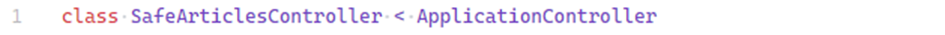

<!-- Figure 72: ApplicationController with protect_from_forgery -->
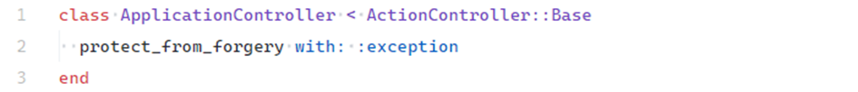

---

### Unsafe Controller

In `UnsafeArticlesController`, CSRF protection is explicitly disabled:

<!-- Figure 73: skip_forgery_protection in controller -->
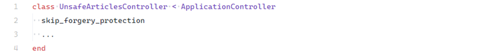

The form is rendered without the token:

<!-- Figure 74: Form without authenticity_token -->
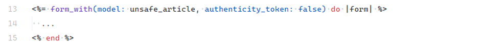

---

### CSRF Attack Simulation

A malicious site hosted at `http://localhost:3001` submits a forged request.

<!-- Figure 75: Attacker site with CSRF test form -->
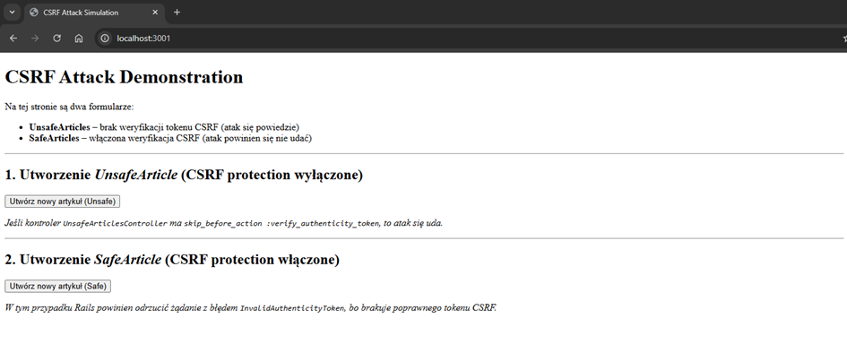

<!-- Figure 76: Example HTML form used for CSRF attack -->
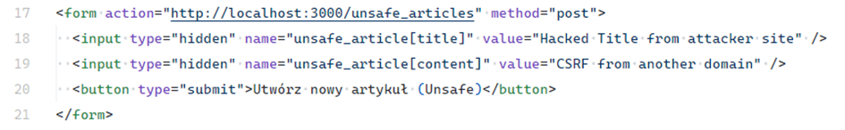

If the target controller has CSRF disabled, the request succeeds and a new article is created:

<!-- Figure 77: Successful CSRF attack creating an article -->
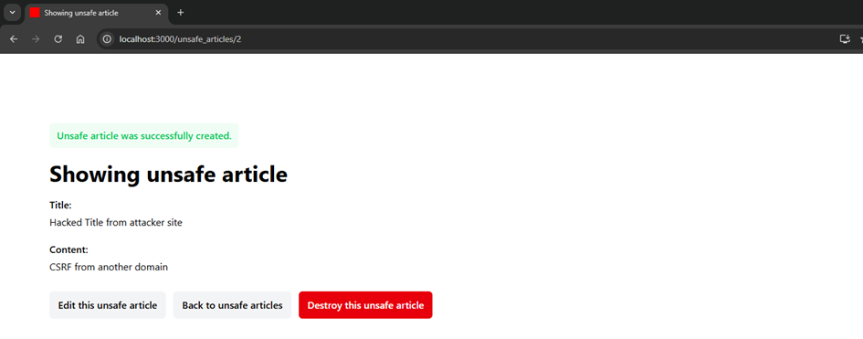

When targeting the safe controller, Rails rejects the request with `ActionController::InvalidAuthenticityToken`:

<!-- Figure 78: InvalidAuthenticityToken error -->
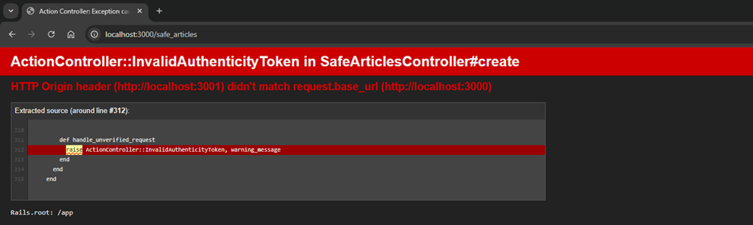

---

## Impact

Without CSRF protection, attackers can:

* Perform unauthorized actions on behalf of the user.
* Compromise accounts (especially when combined with XSS).
* Cause data tampering, loss of trust, and regulatory violations (e.g., GDPR).

---

## Mitigation

* **Always validate CSRF tokens** for state-changing actions using session-based cookies.
* **Keep `protect_from_forgery` enabled** in all controllers. Disable it only for stateless APIs that use alternative authentication (JWT, OAuth).
* **Use Rails form helpers** (`form_with`, `form_for`) to automatically embed tokens.
* **Handle AJAX requests** by including the token in headers (`X-CSRF-Token`). Rails provides the token via `<meta>` tags for easy retrieval.

---
