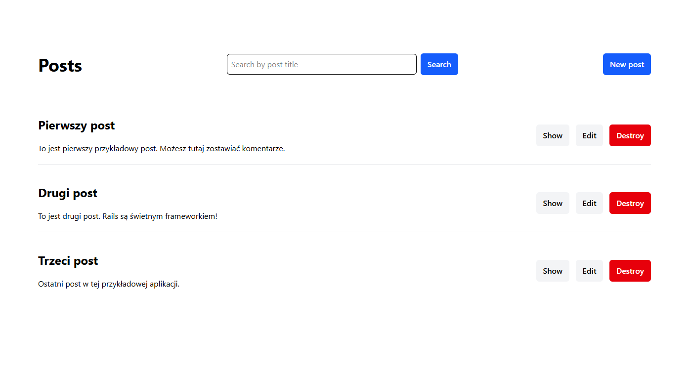
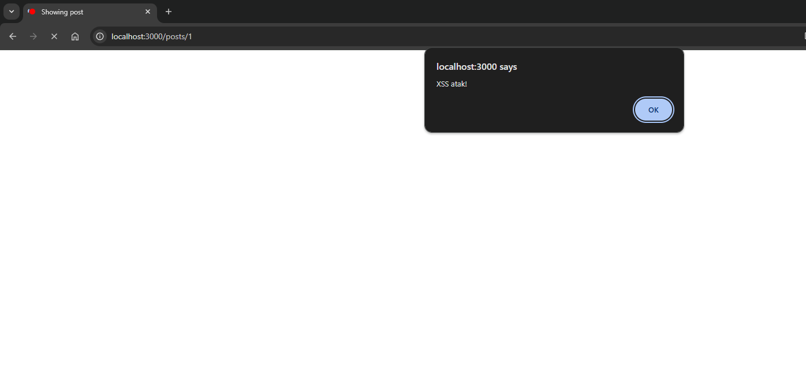
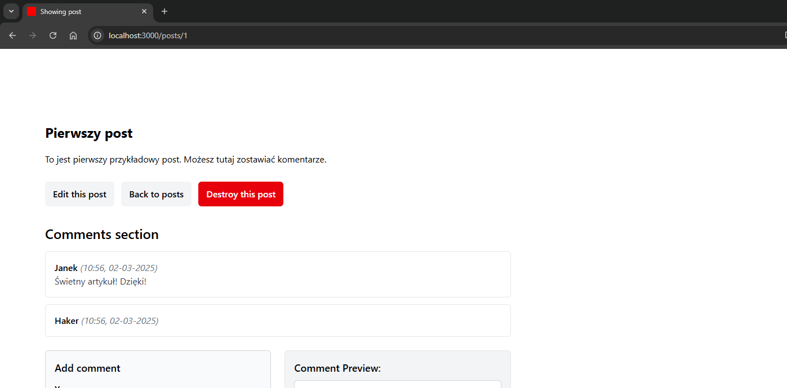
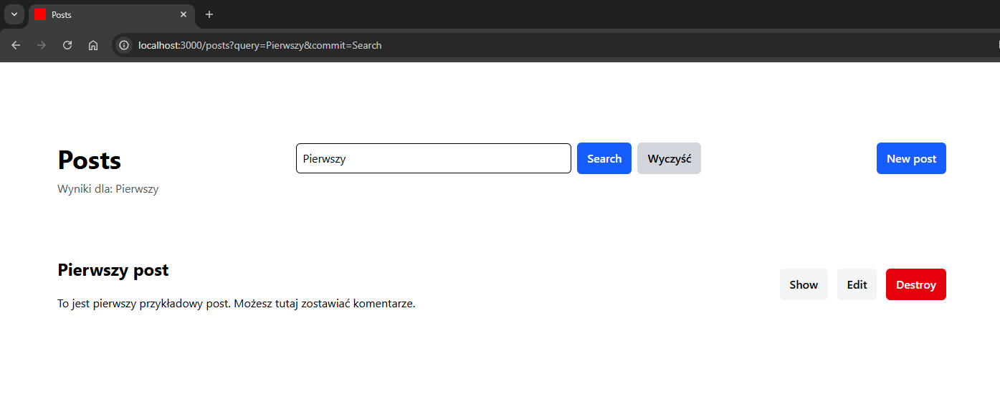
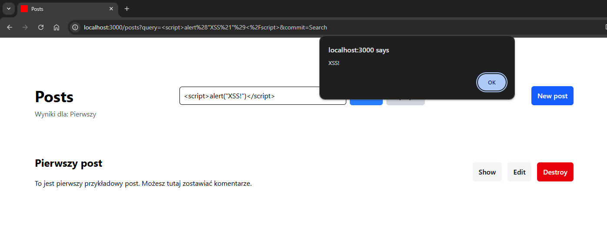
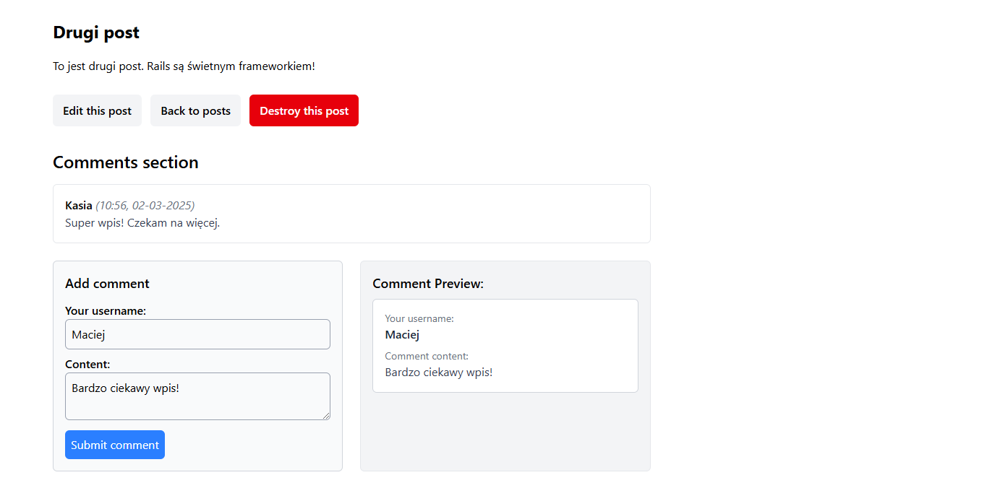

# Cross-Site Scripting (XSS)

Uruchomienie przykładowej aplikacji dla tej podatności:

```bash
# Aby uruchomić aplikację, wykonaj następującą komendę:
docker compose up -d

# Zatrzymanie aplikacji odbywa się za pomocą:
docker compose down

# W celu rozpoczęcia pracy od nowa (usunięcia wszystkich danych) użyj:
docker compose restart
```

## Opis

**Cross-Site Scripting (XSS)** to jedna z najczęstszych podatności aplikacji webowych, umożliwiająca atakującemu wstrzyknięcie złośliwego kodu JavaScript do przeglądarki użytkownika. Atakujący może wykorzystać tę lukę do kradzieży sesji, wykradania danych, przeprowadzania phishingu lub zmiany zawartości strony.

Wyróżnia się trzy główne typy XSS:
- **Stored XSS** – złośliwy kod zostaje zapisany na serwerze (np. w bazie danych) i jest wyświetlany każdemu użytkownikowi odwiedzającemu stronę.
- **Reflected XSS** – kod JavaScript jest przekazywany w parametrze URL i zwracany przez aplikację bez odpowiedniego filtrowania.
- **DOM-based XSS** – atak następuje bezpośrednio w przeglądarce, kiedy aplikacja manipuluje DOM, np. przez `innerHTML` na nieprzefiltrowanym wejściu.

## Przykład

W celu demonstracji podatności XSS w aplikacji Ruby on Rails, przygotowano prostą aplikację blogową, która obsługuje posty oraz komentarze.

Aplikacja pozwala użytkownikom na dodawanie postów i komentowanie ich bez konieczności logowania. W różnych miejscach aplikacji umieszczono podatne fragmenty kodu, aby zilustrować trzy typy ataków XSS.



### Stored XSS

W aplikacji występuje podatność **Stored XSS**, gdy użytkownik może zapisać w bazie danych złośliwy kod, który następnie jest wyświetlany na stronie innym użytkownikom.

Po wejściu w szczegóły wybranego posta, użytkownicy mogą dodawać komentarze, które są zapisywane w bazie danych i wyświetlane w widoku za pomocą `raw`, co umożliwia wykonanie złośliwego JavaScriptu.

Jeżeli użytkownik doda komentarz zawierający złośliwy kod, np. `<script>alert('XSS')</script>`, to po odświeżeniu strony złośliwy kod zostanie wykonany u każdego użytkownika odwiedzającego stronę.



W naszym przypadku, użytkownik o nazwie `Haker` dodał złośliwy komentarz, który wyświetla alert z informacją `XSS`. Komentarz został zinterpretowany jako kod JavaScript i wykonany w przeglądarce, dlatego ten komentarz nie ma wyświetlonej żadnej treści.



Dzieję się tak, ponieważ w kodzie specjalnie umożliwiono wykonanie złośliwego kodu, używając metody `raw` w widoku.

```html
<p class="text-gray-700"><%= raw comment.content %></p>
```

Rails domyślnie chroni przed XSS dzięki automatycznemu escapowaniu wyjścia w widokach (`<%= %>`), więc samo poprawne skorzystanie z tagów ERB jest wystarczające, aby zapobiec atakom XSS.

### Reflected XSS

Reflected XSS występuje, gdy aplikacja zwraca nieprzefiltrowane dane wejściowe użytkownika bez ich uprzedniego zabezpieczenia.

W aplikacji dodano funkcję wyszukiwania postów, która pobiera wartość parametru query z adresu URL i wyświetla ją w wynikach wyszukiwania bez zabezpieczenia.



Jeżeli użytkownik wpisze w pole wyszukiwania złośliwy kod, np. `<script>alert('XSS')</script>`, to po kliknięciu przycisku `Szukaj` kod zostanie wykonany w przeglądarce.



Analogicznie jak w poprzednim przypadku, złośliwy kod jest wykonywany, ponieważ w kodzie umożliwiono wykonanie złośliwego kodu, używając metody `raw` w widoku. W celu zabezpieczenia aplikacji przed atakami XSS, należy usunąć metodę `raw` i skorzystać z tagów ERB w domyślny sposób.

```html
<% if params[:query].present? %>
  <p class="mt-2 text-gray-600">Wyniki dla: <%= raw params[:query] %></p>
<% end %>
```

### DOM-based XSS

DOM-based XSS to typ ataku, w którym podatność istnieje wyłącznie po stronie klienta, np. poprzez dynamiczne manipulowanie treścią strony w JavaScript.

Aplikacja posiada funkcję podglądu komentarza w czasie rzeczywistym. JavaScript pobiera wartość wpisaną w formularzu i wstawia ją do podglądu komentarza za pomocą `innerHTML`.



Jeżeli użytkownik wpisze w formularzu złośliwy kod, np. ``, to w wyniku ten kod JavaScript zostanie wykonany natychmiast w podglądzie, jeszcze przed zapisaniem komentarza.


Wynika to z faktu, że w kodzie JavaScript użyto metody `innerHTML`, która interpretuje wprowadzone dane jako kod HTML.

```javascript
document.getElementById("comment-content").addEventListener("input", function() {
  document.getElementById("live-preview-content").innerHTML = this.value;
});
```

Aby zabezpieczyć aplikację przed atakami XSS, należy użyć metody `textContent`, która traktuje wprowadzone dane jako zwykły tekst.

```javascript
document.getElementById("comment-content").addEventListener("input", function() {
  document.getElementById("live-preview-content").textContent = this.value;
});
```

## Skutki

Ataki XSS mogą prowadzić do poważnych konsekwencji, zarówno dla użytkowników, jak i dla aplikacji internetowych, w tym tych opartych na Ruby on Rails.
- **Kradzież sesji użytkownika** – Atakujący może przechwycić ciasteczka sesyjne użytkownika i uzyskać nieautoryzowany dostęp do konta. W aplikacjach Rails, jeśli sesja użytkownika nie jest odpowiednio zabezpieczona flagą HttpOnly, XSS może pozwolić na jej przejęcie.
- **Phishing i socjotechnika** – Poprzez zmianę zawartości strony atakujący może wyświetlić fałszywe formularze logowania lub wiadomości, zachęcające do podania wrażliwych danych.
- **Modyfikacja zawartości strony** – Wstrzyknięcie kodu JavaScript może zmienić działanie aplikacji, np. fałszować treści w postach czy formularzach.
- **Rozprzestrzenianie malware** – Atakujący może wykorzystać XSS do automatycznego przekierowywania użytkowników na złośliwe strony internetowe.
- **Przechwycenie tokenów CSRF** – XSS może być wykorzystany do kradzieży tokenów zapobiegających atakom CSRF w Rails, umożliwiając atakującemu wykonanie nieautoryzowanych żądań.
- **Omijanie zabezpieczeń Rails** – Rails domyślnie escapuje dane, ale niektóre nieostrożne praktyki, takie jak użycie raw, html_safe, czy brak walidacji danych wejściowych, mogą skutkować podatnościami XSS.

## Zalecenia

Aby skutecznie chronić aplikacje przed atakami XSS, należy stosować odpowiednie zabezpieczenia, zarówno na poziomie ogólnych dobrych praktyk, jak i specyficznych mechanizmów w Ruby on Rails.

- **Zawsze escapuj dane wyjściowe** – Rails domyślnie escapuje zmienne w `<%= %>`, co chroni przed XSS. Nigdy nie używaj `raw` ani `html_safe` do wyświetlania wejścia użytkownika.

- **Używaj sanitize do filtrowania HTML** – Jeśli aplikacja pozwala użytkownikom na wprowadzanie HTML (np. edytory WYSIWYG), korzystaj z np. `sanitize(@content, tags: %w[p b i u])`, aby ograniczyć dostępne znaczniki.

- **Unikaj innerHTML w JavaScript** – Do dynamicznej manipulacji treścią w DOM stosuj np. `textContent`, aby zapobiec wykonaniu skryptów.

- **Zastosuj Content Security Policy (CSP)** – Nagłówki CSP mogą zablokować wykonywanie nieautoryzowanych skryptów. W Rails można je skonfigurować np. w `config/initializers/content_security_policy.rb`.

- **Waliduj dane wejściowe** – Upewnij się, że użytkownicy nie mogą przesyłać złośliwego kodu JavaScript poprzez formularze czy parametry URL.

- **Zabezpiecz ciasteczka sesyjne** – Włącz flagę HttpOnly, aby ciasteczka sesyjne były niedostępne dla JavaScriptu:
  ```ruby
  Rails.application.config.session_store :cookie_store, key: '_session_id', httponly: true
  ```

- **Unikaj nadmiernego zaufania do zewnętrznych zasobów** – Jeśli ładujesz skrypty lub inne zasoby z zewnętrznych serwerów, upewnij się, że pochodzą one z zaufanych źródeł.