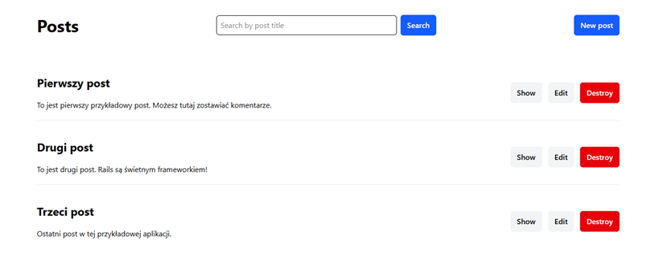
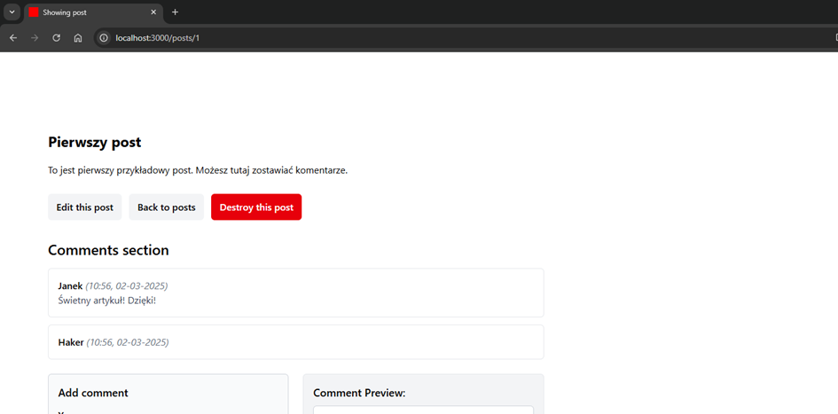
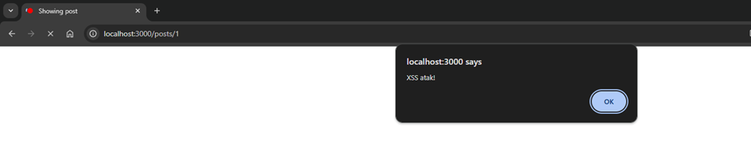
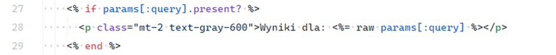
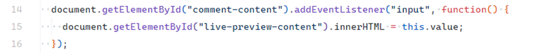
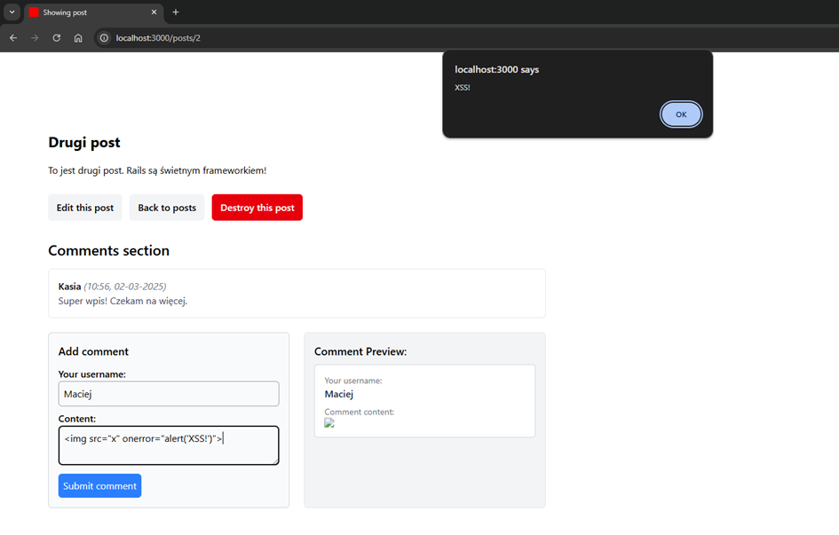

# Cross-Site Scripting (XSS)

## Description

**Cross-Site Scripting (XSS)** is one of the most common vulnerabilities in web applications. It allows attackers to inject malicious JavaScript code that is then executed in the victim’s browser. XSS can lead to **session theft**, **data exfiltration**, **phishing**, or **content manipulation**.

Three main types of XSS exist:

* **Stored XSS** – malicious payload is stored on the server (e.g., database) and delivered to other users.
* **Reflected XSS** – malicious payload is reflected directly from the request and executed immediately.
* **DOM-based XSS** – occurs client-side when JavaScript manipulates the DOM using untrusted input (e.g., via `innerHTML`).

---

## Example

Demo app location:

```
ruby-on-rails-security/cross-site-scripting
```

Start the app and open:

```
http://localhost:3000
```

The app allows posting and commenting without authentication. Vulnerable spots demonstrate all three XSS types.

### Homepage

<!-- Figure 54: List of all posts -->


---

### Stored XSS

A malicious user can store JavaScript in a comment.

<!-- Figure 55: Post details with comments -->


<!-- Figure 56: Attacker's comment containing JavaScript -->


<!-- Figure 57: Browser alert confirming Stored XSS -->


Rails uses **ERB** templates, which escape data by default with `<%= … %>`. However, using `raw` disables escaping, making injection possible.

<!-- Figure 58: Vulnerable ERB code using raw -->


---

### Reflected XSS

Search functionality reflects unescaped query parameters.

<!-- Figure 59: Search form -->


<!-- Figure 60: Alert triggered by reflected input -->


<!-- Figure 61: Vulnerable ERB code with raw -->


Fix: remove `raw` and use `<%= … %>` (escaped output).

---

### DOM-based XSS

The comment preview feature updates live in the browser.

<!-- Figure 62: Vulnerable JavaScript code using innerHTML -->


Payload example:

```

```

This executes immediately in the preview area.

<!-- Figure 63: Browser alert confirming DOM-based XSS -->


Fix: replace `innerHTML` with `textContent`.

<!-- Figure 64: Secure implementation using textContent -->


---

## Impact

XSS attacks can:

* Steal session cookies (especially if `HttpOnly` flag is missing).
* Perform phishing or UI manipulation (fake forms, altered content).
* Modify app behavior client-side (alter posts, auto-submit forms).

---

## Mitigation

### Safe rendering of HTML

* Always validate and sanitize input.
* Use Rails default escaping with `<%= … %>`.
* If HTML rendering is required (e.g., WYSIWYG, Markdown), use `sanitize` to whitelist allowed tags.

<!-- Figure 65: Example usage of sanitize -->


⚠️ Avoid using `raw` or `html_safe` on untrusted data.

### Content Security Policy (CSP)

* Restrict execution of scripts to trusted sources.

### Secure cookies

* Mark session cookies with `HttpOnly` to block JavaScript access.

---
