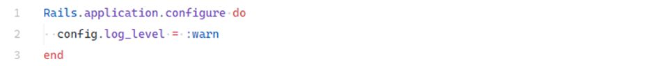
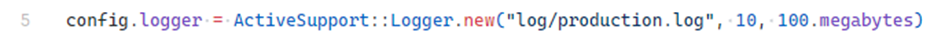
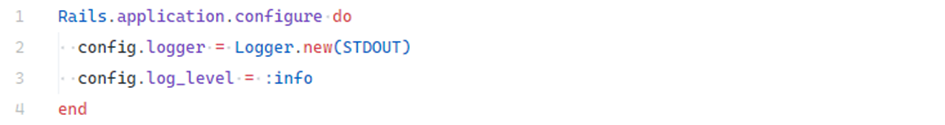
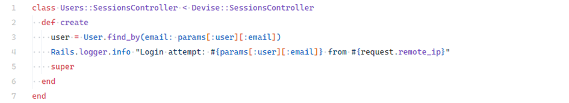
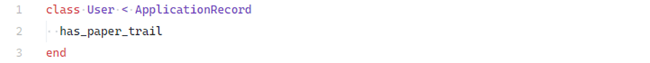

# 5.6.1 Enable Logging

## Description

Logging is a critical part of **security monitoring and incident detection** in web applications. Ruby on Rails ships with built‑in logging, but proper configuration and mindful usage are essential to ensure both **security** and **effective diagnostics**.

Misconfiguration can cause:

* **Missed events** — important activity not recorded.
* **Excessive noise** — too much data to analyze effectively.
* **Data leakage** — sensitive information (passwords, tokens, PII) written to logs.

---

## Example

### Default logging per environment

Rails keeps separate logs for each environment:

* **Development** → `log/development.log` — level: `:debug`
* **Production** → `log/production.log` — level: `:info`
* **Test** → `log/test.log` — level: `:warn`

The active environment is controlled by `RAILS_ENV`, which determines configuration and target log file.

### Log levels

Rails uses Ruby’s `Logger` levels, configurable globally (`config/application.rb`) or per environment (`config/environments/*.rb`) via `config.log_level`:

* `:debug` — very detailed (e.g., SQL, params, session data) — great for development.
* `:info` — general operational info (actions processed, timings).
* `:warn` — potential issues or risky situations.
* `:error` — errors that impacted behavior but didn’t crash the app.
* `:fatal` — critical errors that halt execution.

---

## Impact

Insufficient or excessive logging can lead to:

* **Poor attack visibility** — missed brute‑force attempts, suspicious access, or failed auth events.
* **Harder troubleshooting** — no trace to debug user‑reported issues or outages.
* **Lack of forensics** — no event history to reconstruct and analyze incidents.

---

## Mitigation

### Tune log levels per environment

Set an appropriate verbosity for each environment. In production, prefer `:info` or `:warn` depending on your monitoring needs.

<!-- Figure 115: Example production logging configuration at warning level -->

### Log rotation

Prevent unbounded growth of log files by enabling rotation.

<!-- Figure 116: Production logger configuration with rotation -->

*Example outcome:* keep up to **10** rotated files, each up to **100 MB**.

### Containerized environments

In Docker/Kubernetes, apps are **stateless**. Write logs to **STDOUT** so the platform can collect them (e.g., to ELK/EFK, DataDog).

<!-- Figure 117: Logger configuration redirecting logs to STDOUT -->

### Log key security events

Record significant actions: **successful and failed logins**, **permission changes**, **data modifications**. With Devise, you can add logging in the sessions controller.

<!-- Figure 118: Example logging of login attempts in sessions controller -->

### Audit model changes

For auditing sensitive records (e.g., `User`, `Order`), use a versioning gem such as **PaperTrail** to record create/update/delete and enable rollbacks.

<!-- Figure 119: Example PaperTrail usage in User model -->

---
