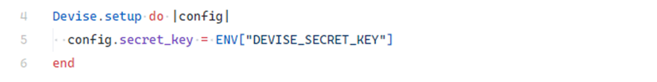

# Use of Hard-Coded Cryptographic Key

## Description

The **Use of Hard-Coded Cryptographic Key** vulnerability occurs when cryptographic keys are stored directly in the application source code. These keys are often used for:

* Encrypting sensitive data
* Signing session cookies
* Generating authentication tokens

If exposed (e.g., through a public repository), attackers can hijack sessions, forge requests, or escalate privileges.

---

## Example

A common case of this vulnerability is mismanaging the secret key required by the **Devise** authentication library. Devise requires `Devise.secret_key` to be defined in `config/initializers/devise.rb`.

This key is used for:

* Signing session cookies
* Generating authorization tokens (e.g., password reset)
* Ensuring integrity of login and “remember me” features

### Insecure Implementation

<!-- Figure 30: Example of insecure hard-coded Devise secret -->


```ruby
# ❌ Insecure (hard-coded secret)
Devise.secret_key = "1234567890abcdef1234567890abcdef"
```

If this secret leaks, an attacker can generate valid session cookies and take over accounts without knowing user credentials.

---

## Impact

Leaking hard-coded cryptographic keys in a Rails application can lead to:

* Forged session and authentication tokens
* Signed malicious requests accepted by the app
* Decryption of sensitive stored data
* Unauthorized access to user accounts or external systems

---

## Mitigation

### Avoid Storing Keys in Source Code

Secrets should never be committed to source code or versioned configuration files. Instead, use secure mechanisms like:

* **Rails Credentials** (`config/credentials.yml.enc`)
* **Environment variables** loaded at runtime

#### Using Rails Credentials

<!-- Figure 31: Secure Devise secret with Rails Credentials -->


```ruby
# ✅ Secure (Rails Credentials)
Devise.secret_key = Rails.application.credentials.devise[:secret_key]
```

#### Using Environment Variables

<!-- Figure 32: Secure Devise secret with environment variables -->


```ruby
# ✅ Secure (ENV variables)
Devise.secret_key = ENV["DEVISE_SECRET_KEY"]
```

### Key Rotation and Session Invalidation

* Rotate cryptographic keys regularly.
* If a leak is suspected, immediately invalidate all active sessions and issue new keys.

### Proper Environment Variable Management

* Store variables outside the application code (e.g., `.env` files, CI/CD secrets, or cloud provider key stores).
* Ensure `.env` and similar files are excluded from repositories.

### Monitor and Detect Leaks

Use automated tools to scan repositories for secrets:

* **GitLeaks**
* **TruffleHog**

Regular scanning helps detect accidental secret exposure early.

---
