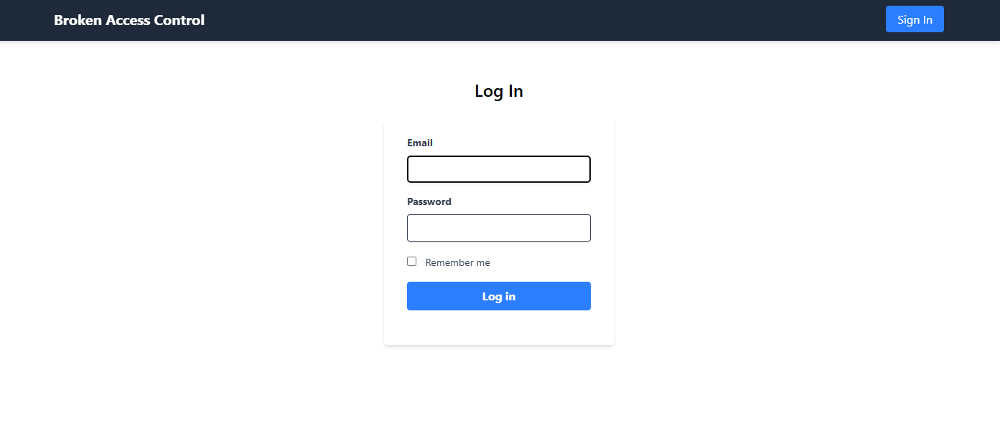
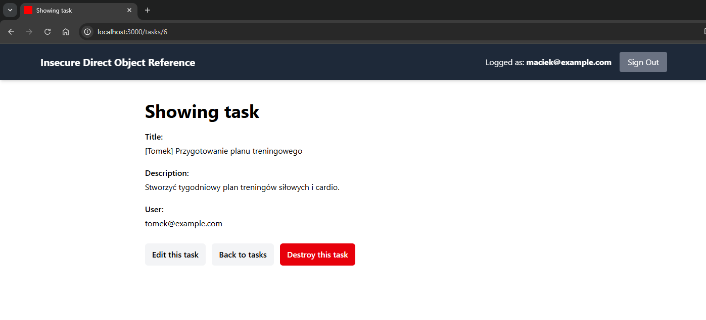
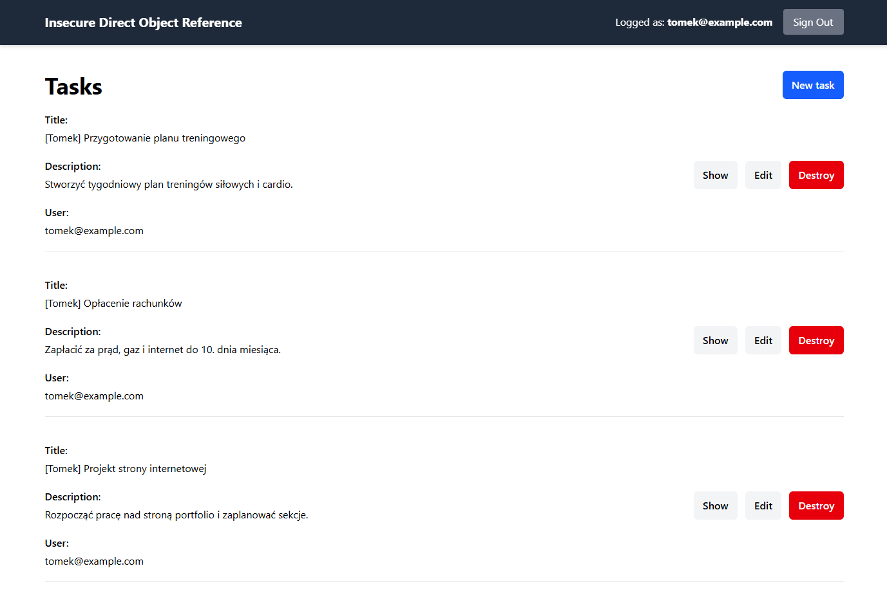
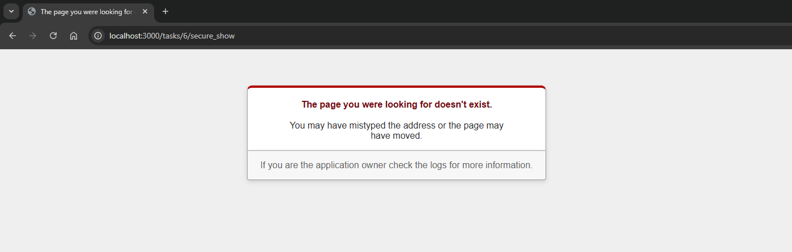

# Insecure Direct Object Reference

Aplikacja dla tego przykładu znajduje się w katalogu `broken-access-control`.

https://github.com/maciejb2k/ruby-on-rails-security/tree/main/broken-access-control

## Przykład

W tym przykładzie mamy aplikację, w której użytkownicy mogą zarządzać swoimi zadaniam.



W aplikacji występują dwaj użytkownicy:
- Użytkownik 1: `maciek@example.com:password`
- Użytkownik 1: `tomek@example.com:password`

Obaj użytkownicy mają dostęp do swoich zadań, które są dostępne pod adresem `/tasks/`.

Po zalogowaniu się jako użytkownik `maciek@example.com`, możemy zobaczyć liste jego wszystkich zadań:


Gdy wejdziemy w szczegóły zadania, widzimy, że należy ono na pewno do zalogowanego użytkownika i ma ono `id=1`.


Co gdybyśmy spróbowali zmienić `id` zadania w adresie URL na `6`?



Modyfikując adres URL, jesteśmy w stanie zobaczyć zadanie należące do użytkownika `tomek@example.com`. Oznacza to, że aplikacja jest podatna na atak Insecure Direct Object Reference, ponieważ nie sprawdza, czy użytkownik ma dostęp do zasobu, do którego próbuje uzyskać dostęp.

Jak widać zadanie to należy do użytkownika `tomek@example.com`, poniżej znajduje się jego widok zadań po zalogowaniu:



Przyjrzyjmy się metodzie `show` w kontrolerze `TasksController`:

```ruby
def show
  @task = Task.find(params[:id])
  render :show
end
```

Jak widać, metoda `show` nie sprawdza, czy zalogowany użytkownik ma dostęp do zasobu, do którego próbuje uzyskać dostęp. W celu zabezpieczenia aplikacji, należy dodać odpowiednią weryfikację dostępu.

Poprawnie zaimplementowana metoda show powinna wyglądać następująco. W takim przypadku zwracamy tylko zadania należące do zalogowanego użytkownika:

```ruby
def secure_show
  @task = current_user.tasks.find(params[:id])
  render :show
end
```

W naszej aplikacji, gdybyśmy chcieli otrzymać dostęp do tego zasobu z użyciem metody `secure_show`, otrzymamy status '404 Not Found':


