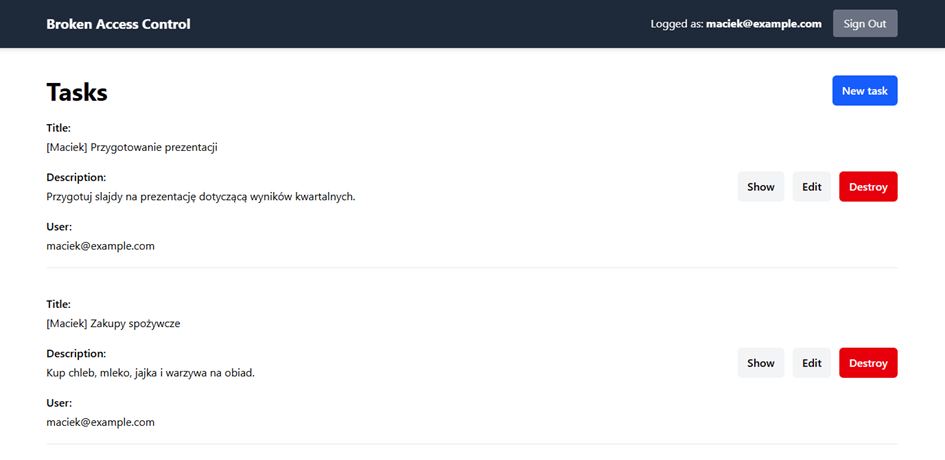
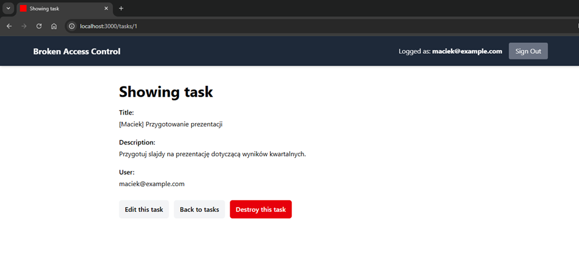
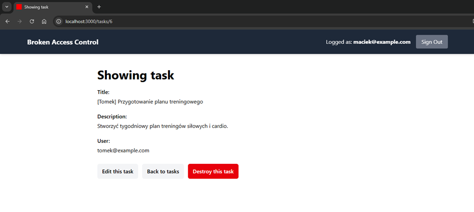
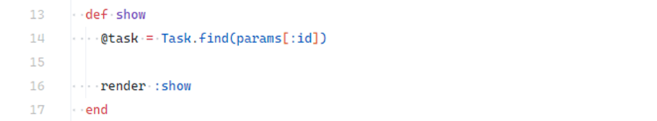
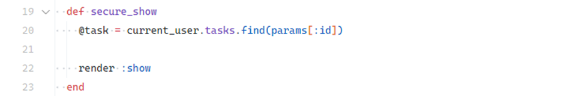
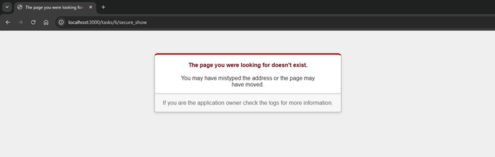

# Insecure Direct Object References (IDOR)

## Description

**IDOR** occurs when an application exposes internal identifiers (e.g., `id` in the URL) without verifying whether the logged-in user is authorized to access the resource. This vulnerability arises because queries are not limited to the data belonging to the resource owner.

---

## Example

Demo location:

```
ruby-on-rails-security/broken-access-control
```

Start the app and open:

```
http://localhost:3000
```

Test credentials:

* **User 1:** `maciek@example.com` / `password`
* **User 2:** `tomek@example.com` / `password`

1. Log in as **[maciek@example.com](mailto:maciek@example.com)**.
2. The task list shows only the tasks belonging to this user.

   <!-- Figure 10: Task list for logged-in user -->
   
3. Open the first task; in the URL you will see `id=1`, which belongs to Maciek.

   <!-- Figure 11: Task id=1 -->
   
4. Manually change the URL to `/tasks/6`.
   <!-- Figure 12: Task id=6 belonging to another user is visible -->
  

Now you can view Tomek’s task — proof that the app is vulnerable to IDOR.

#### Why it happens

The `show` method in `app/controllers/tasks_controller.rb` fetches tasks globally:

<!-- Figure 13: Insecure show action -->


#### Fix

Scope the lookup to the authenticated user, e.g., via `current_user`:

<!-- Figure 14: Secure show action -->

After applying this fix, accessing another user’s task results in `404 Not Found`:

<!-- Figure 15: 404 error page -->

---

## Impact

* Unauthorized access to other users’ data (tasks, profiles, documents).
* Ability to modify or delete resources owned by other users.
* Violation of confidentiality and integrity of stored data.

---

## Mitigation

* **Always scope queries** to the logged-in user:

  ```ruby
  current_user.tasks.find(params[:id])
  ```
* Use `404` instead of `403` for non-owned resources to avoid disclosing their existence.
* **Use UUIDs** instead of sequential IDs to make guessing harder.
* Centralize and enforce ownership checks consistently across controllers.

---
