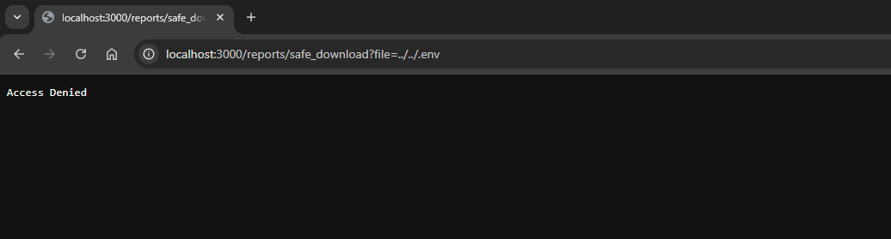

# Local File Inclusion (LFI)

```bash
# Aby uruchomić aplikację, wykonaj następującą komendę:
docker compose up -d

# Zatrzymanie aplikacji odbywa się za pomocą:
docker compose down

# W celu rozpoczęcia pracy od nowa (usunięcia wszystkich danych) użyj:
docker compose restart
```



