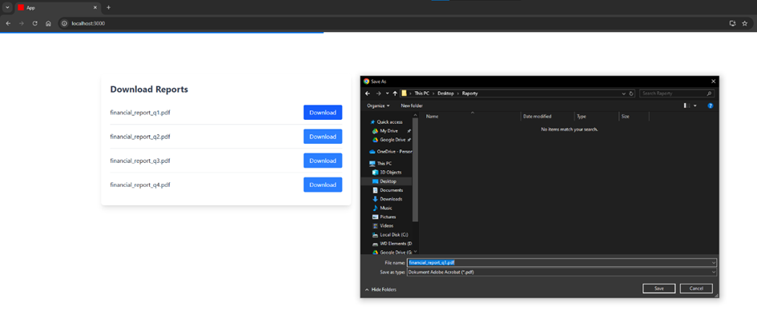
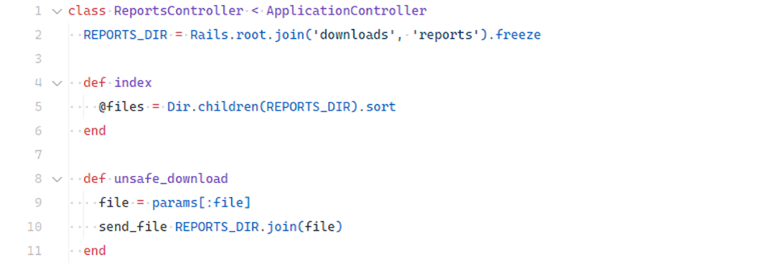
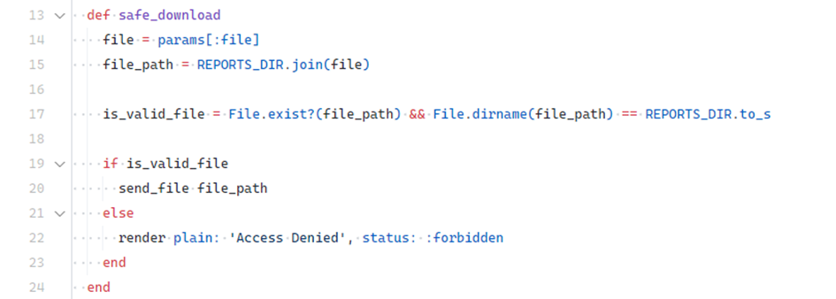

# Local File Inclusion (LFI)

## Description

**Local File Inclusion (LFI)** occurs when an attacker can load arbitrary files from the server by manipulating unvalidated user input.

In Ruby on Rails, this vulnerability can appear when applications dynamically load files based on user-supplied values using methods like `render`, `send_file`, or `File.read`.

---

## Example

Demo location:

```
ruby-on-rails-security/local-file-inclusion
```

Start the app and open:

```
http://localhost:3000
```

The app:


The demo application allows users to download financial reports stored locally on the server. A sample download link looks like this:

```
http://localhost:3000/reports/unsafe_download?file=financial_report_q1.pdf
```

In the controller (`reports_controller.rb`), the vulnerable method is implemented as:

```ruby
# ❌ Insecure
def unsafe_download
  file = params[:file]
  send_file(file) # no validation
end
```

<!-- Figure 22: Vulnerable controller methods -->


Since the `file` parameter is not validated, an attacker can request sensitive files outside the intended directory:

```
http://localhost:3000/reports/unsafe_download?file=../../.env
```

This exposes the `.env` file containing sensitive configuration. Similarly, files such as `/etc/passwd` or `/etc/hosts` can be accessed.

### Fix

To secure the app, validate that the requested file is within the allowed directory (`reports`).

```ruby
# ✅ Secure
def safe_download
  base_path = Rails.root.join("reports")
  file_path = File.expand_path(File.join(base_path, params[:file]))

  if file_path.start_with?(base_path.to_s) && File.exist?(file_path)
    send_file(file_path)
  else
    head :forbidden
  end
end
```

<!-- Figure 23: Safe controller method -->


Now, attempting to fetch files outside the `reports` directory returns:

```
HTTP 403 Forbidden
```

```
http://localhost:3000/reports/safe_download?file=../../.env
```

<!-- Figure 24: 403 Forbidden when accessing unauthorized file -->


---

## Impact

* Reading sensitive system or configuration files (e.g., `/etc/passwd`, `.env`).
* Disclosure of secrets such as API keys, user data, or passwords.
* Possible escalation to **Remote Code Execution (RCE)** if executable code files are included.

---

## Mitigation

* Always **validate and sanitize user input** before using it in file paths.
* Restrict access to files by checking that paths do not escape the intended directory.
* Avoid dynamically building paths from user input; use absolute, predefined paths instead.
* When using methods like `send_file`, never pass unchecked user parameters directly.
* Consider **whitelisting** allowed files or directories to explicitly define accessible resources.

---
