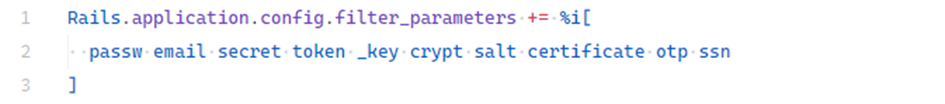
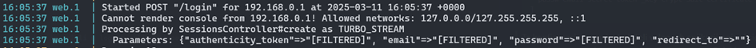
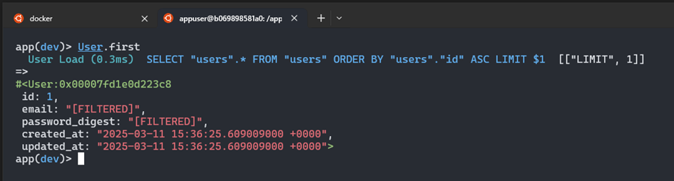
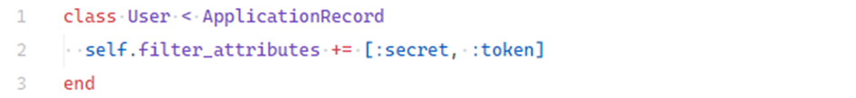
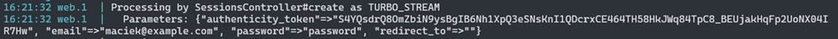

# 5.6.2 Logging Sensitive Information

## Description

Improper logging of sensitive data — such as **passwords, API tokens, or credit card numbers** — can lead to unintended disclosure and serious security breaches.

Rails provides mechanisms to prevent this risk, such as **`filter_parameters`** and **`filter_attributes`**, which automatically hide specified fields in logs. However, missing configuration, overly broad filtering, or manual logging without proper masking can cause sensitive information to be written to log files or external monitoring systems, making it an easy target for attackers or unauthorized users.

---

## Examples

Rails includes a default mechanism to filter sensitive parameters from logs.

The file `config/initializers/filter_parameters.rb` contains a list of keywords used to mask sensitive data.

<!-- Figure 120: Configuration of parameter filtering in Rails -->

If any request parameter name contains one of the configured keywords, its value is replaced with **`[FILTERED]`**.

<!-- Figure 121: Controller logs showing masked password value -->

This filtering also applies in the **Rails console (REPL)** started with `rails console`. Sensitive parameters are not displayed in clear text.

<!-- Figure 122: Example of parameter filtering in the interactive console -->

Additionally, you can hide attributes at the **ActiveRecord model level** using `self.filter_attributes` (e.g., in the `User` model).

<!-- Figure 123: Example of excluding attributes at the model level -->

If these mechanisms are disabled or omitted, sensitive information may appear in logs in plain text.

<!-- Figure 124: Example when filter_parameters is disabled and raw params are logged -->

---

## Risks

* **Sensitive data exposure** — passwords, tokens, and secrets may be written to logs in plain text.
* **Compliance violations** — careless logging can violate privacy policies or regulations (e.g., GDPR).
* **Attractive target** — logs are often text files or exported to third‑party systems, making them a high‑value target for attackers.

---

## Mitigations

* **Use `filter_parameters` and `filter_attributes`.** Keep the keyword list up to date as the app evolves to cover all sensitive fields.
* **Avoid logging full data structures.** Do not log entire ActiveRecord objects, full HTTP requests, or raw user input. Log only what’s necessary for diagnostics (errors, exceptions, system actions).
* **Be cautious with external logging services.** Ensure logs sent to third‑party systems don’t contain data that must remain within the application environment.

---
