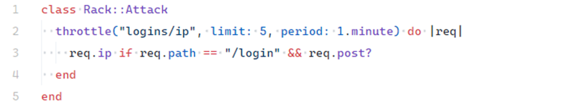

# 5.4.3 Login Rate Limiting

## 5.4.3.1 Description

**Login Rate Limiting** is a vulnerability caused by the lack of restrictions on the number of login attempts in a web application. This allows an attacker to perform brute-force attacks or credential stuffing attacks (testing leaked username/password combinations).
As a result, unauthorized access to user accounts may occur.

In Ruby on Rails applications, up until version **7.2**, external libraries were required to implement login throttling. In the newest versions, Rails now provides **built-in rate limiting support**, which makes protection much easier to implement.

---

## 5.4.3.2 Example

Demo location:

```
ruby-on-rails-security/insecure-design
```

After starting the app, open:

```
http://localhost:3000
```

The demo app contains a login form without any rate limiting.
A user – or an attacker – can repeatedly attempt to log in with different credentials until successful.

<!-- Figure 101: Unprotected login form -->


---

## 5.4.3.3 Impact

The absence of login rate limiting can lead to serious risks:

* **Unauthorized account access** – brute-force or credential stuffing.
* **Bypassing security mechanisms** – no limits on password reset or 2FA verification attempts.
* **System abuse & DoS** – excessive requests (registrations, password resets, costly backend ops) may overload the server.
* **Brute-forcing OTP (2FA)** – unlimited attempts allow guessing one-time codes.

---

## 5.4.3.4 Mitigation

### Rails 7.2+

Since **Rails 7.2**, a native `rate_limit` mechanism is available to define request limits directly in controllers.

<!-- Figure 102: Example rate limiting implementation in a controller -->


Parameters:

* `to: 5` – max 5 requests (e.g., login attempts),
* `within: 1.minute` – per 1 minute window,
* `with:` – what action to take after exceeding the limit (e.g., redirect),
* `only:` – specifies which actions are affected (e.g., `create`).

If the threshold is exceeded, the user is redirected to a custom error page (`rate_limited_path`) with **HTTP 429 Too Many Requests**.

<!-- Figure 103: Error screen after exceeding limit -->


---

### Rails < 7.2

For older Rails versions, the recommended solution is the **Rack::Attack** gem, which acts as middleware to throttle requests based on IP or other criteria.

<!-- Figure 104: Example Rack::Attack configuration -->


Rack::Attack can also protect other sensitive endpoints such as:

* password resets,
* 2FA verification,
* account registration,
* API endpoints.

---
