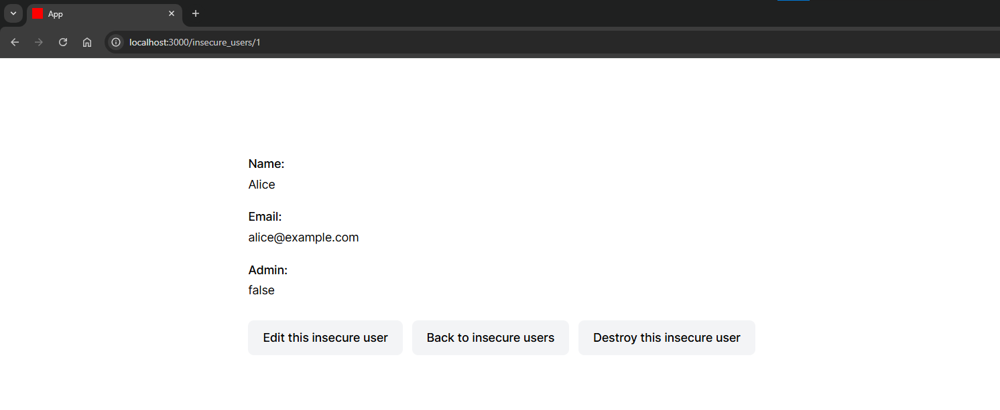
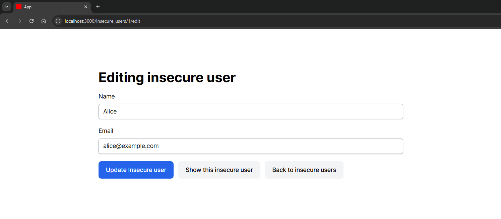
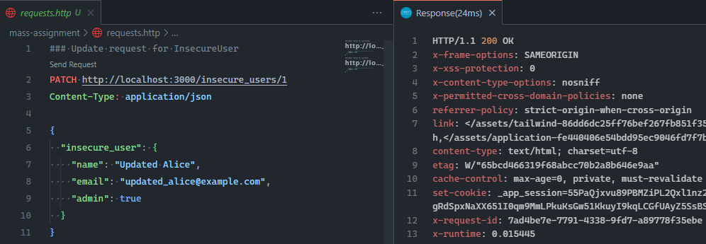
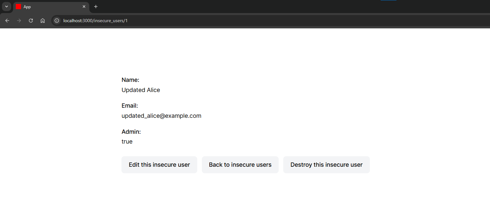
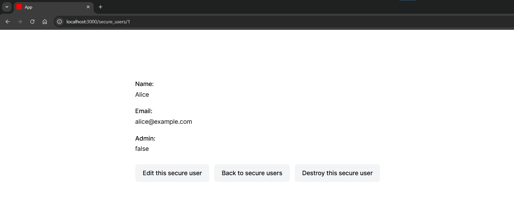
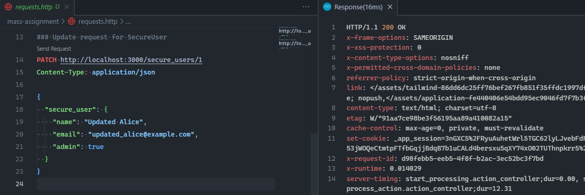
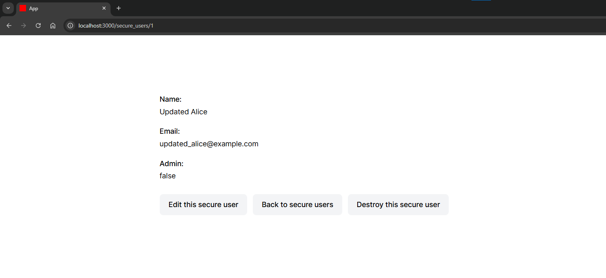

# Mass Assignment

Uruchomienie przykładowej aplikacji dla tej podatności:

```bash
# Aby uruchomić aplikację, wykonaj następującą komendę:
docker compose up -d

# Zatrzymanie aplikacji odbywa się za pomocą:
docker compose down

# W celu rozpoczęcia pracy od nowa (usunięcia wszystkich danych) użyj:
docker compose restart
```

## Opis

Mass assignment to mechanizm w Ruby on Rails, który pozwala na przypisanie wielu parametrów do modelu jednocześnie, na przykład podczas tworzenia nowego rekordu lub aktualizacji istniejącego. Domyślnie Rails chroni aplikację przed niepożądanym przypisaniem parametrów, jednak nieprawidłowa konfiguracja może prowadzić do podatności bezpieczeństwa.

## Przykład podatności

W tej aplikacji przygotowano dwa modele użytkowników:
- `InsecureUser` - model podatny na atak masowego przypisania.
- `SecureUser` - model chroniony przed atakami masowego przypisania.

### Krok 1: Uruchomienie aplikacji i weryfikacja podatności

Po uruchomieniu aplikacji przejdź pod adres:

http://localhost:3000/insecure_users


Zobaczysz listę użytkowników. Następnie otwórz stronę pierwszego użytkownika:

http://localhost:3000/insecure_users/1



Na stronie szczegółów użytkownika widzisz, że atrybut `admin` jest ustawiony na wartość `false`.

### Krok 2: Próba modyfikacji ukrytego atrybutu

Na stronie edycji tego użytkownika nie znajdziesz pola do edycji atrybutu `admin`. Możemy jednak założyć, że potencjalny atakujący może odgadnąć jego istnienie i próbować zmodyfikować go poprzez bezpośrednie wysłanie zapytania HTTP.



Przygotowane zapytanie HTTP zmieniające wartość admin znajdziesz w pliku requests.http.



Wykonaj je za pomocą narzędzia do testowania API, np. wtyczki **REST Client** w **Visual Studio Code**, klikając przycisk Send Request.

### Krok 3: Sprawdzenie wyniku
Po wysłaniu zapytania otrzymasz odpowiedź 200 OK. Otwórz ponownie stronę użytkownika:
http://localhost:3000/insecure_users/1



Zobaczysz, że atrybut admin został zmieniony na true, co potwierdza podatność modelu InsecureUser.

## Zalecenia

Ruby on Rails oferuje domyślne zabezpieczenie przed atakami masowego przypisania, wymuszając stosowanie strong parameters w kontrolerach. Dzięki temu możemy jawnie określić, które atrybuty mogą być przypisywane podczas tworzenia lub aktualizacji rekordu.

### Strong Parameters
Jeśli spróbujesz przypisać atrybuty do modelu bez ich jawnego określenia w strong parameters, Rails zgłosi błąd:
`ActiveModel::ForbiddenAttributesError`.

W tej aplikacji celowo wyłączono domyślne zabezpieczenie, zmieniając konfigurację w pliku `config/application.rb`:

```ruby
config.action_controller.permit_all_parameters = true
```

W prawdziwych aplikacjach nie należy wyłączać tego mechanizmu, lub ustawić go na `false`.

### Przykład poprawnego zabezpieczenia
W przypadku modelu SecureUser zastosowano strong parameters w kontrolerze, dzięki czemu możliwe jest przypisanie jedynie określonych atrybutów, np. `name` i `email`. Atrybut `admin` jest wyłączony z listy dozwolonych parametrów:

```ruby
def secure_user_params
  params.require(:secure_user).permit(:name, :email)
end
```

### Weryfikacja zabezpieczeń
Po wysłaniu zapytania HTTP dla modelu `SecureUser`, aplikacja zwróci odpowiedź `200 OK`.





Jednak atrybut `admin` nie zostanie zmieniony, ponieważ nie został dozwolony w strong parameters.



## Skutki

- **Nadanie sobie nieautoryzowanych uprawnień** – atakujący może ustawić pola takie jak admin: true, role: superuser itp.
- **Modyfikacja wrażliwych atrybutów** – zmiana pól, które normalnie nie powinny być dostępne z poziomu formularza lub API (np. `balance`, `status`, `is_verified`).
- **Całkowite przejęcie kont użytkowników lub systemu** – jeśli np. atrybut admin zostanie zmieniony, atakujący może zyskać dostęp do panelu administracyjnego lub danych innych użytkowników.
- **Trwałe naruszenie integralności danych** – zmiana atrybutów może powodować nieodwracalne zmiany w stanie aplikacji (np. zmiana właściciela obiektu).

## Zalecenia

- **Stosowanie strong parameters i whitelistingu atrybutów** – zawsze jawnie określaj, które pola mogą być przypisane masowo (np. permit(:name, :email)), wyłączając wrażliwe pola takie jak `admin`, `role`, `status`.
- **Unikanie globalnego wyłączenia mechanizmu strong parameters** – nie ustawiaj permit_all_parameters = true w konfiguracji aplikacji.
- **Ograniczanie przypisywania pól krytycznych tylko w logice biznesowej** – wartości pól takich jak `admin` powinny być przypisywane wyłącznie wewnętrznie w kontrolerze lub serwisie, bez udziału danych z formularza/API.
- **Regularne testy pod kątem podatności na mass assignment** – testowanie CRUD oraz endpointy API na możliwość przypisania nieautoryzowanych atrybutów przez bezpośrednie zapytania HTTP.
