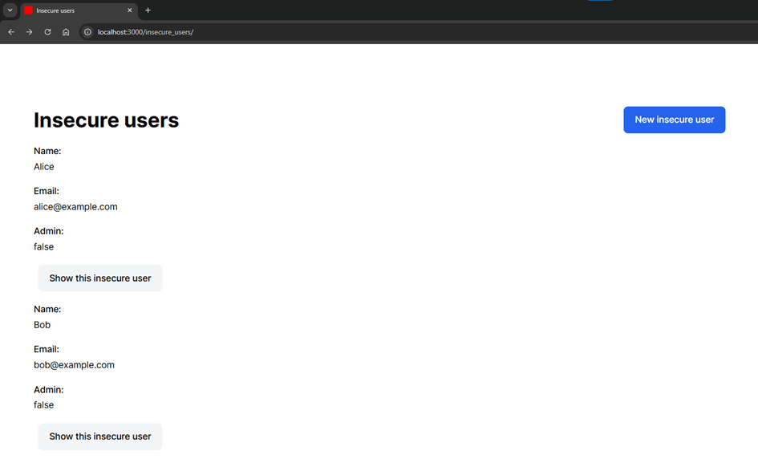
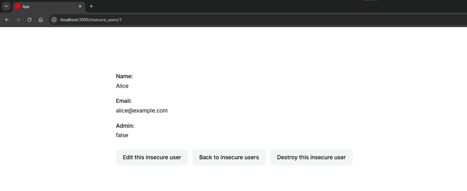
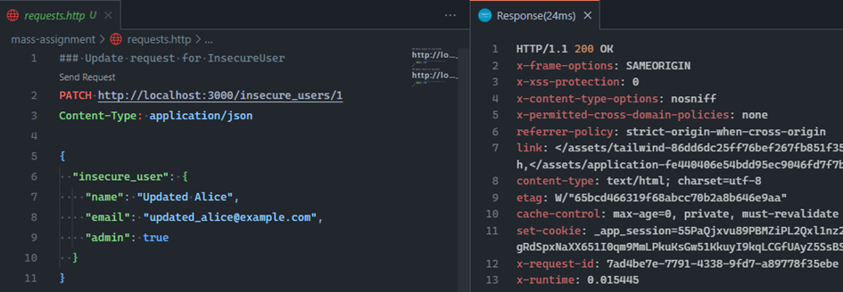
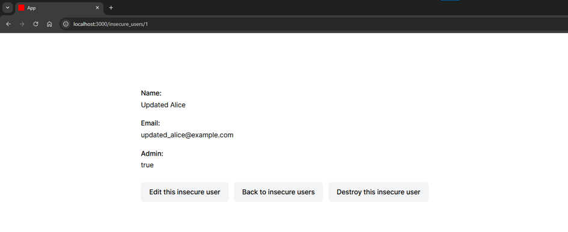
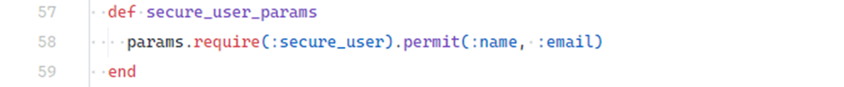
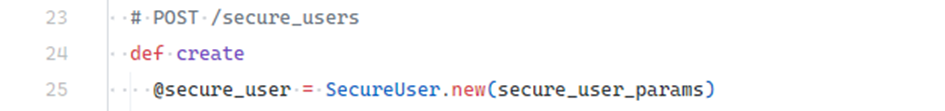
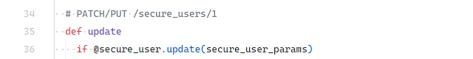
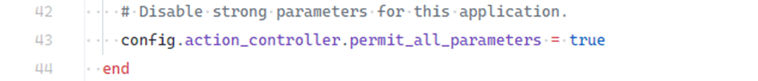

# Mass Assignment Vulnerability

## Description

Mass Assignment is a feature in Ruby on Rails that allows assigning multiple model attributes at once from HTTP request parameters. While convenient for creating and updating records, it becomes a security risk if input parameters are not properly filtered.

This vulnerability occurs when an attacker can modify protected attributes (e.g., `admin` flags or sensitive user data) through crafted HTTP requests. If strong access control is missing, Rails will assign any attributes included in the request.

---

## Example

A vulnerable demo application can be found in:
```
ruby-on-rails-security/mass-assignment
```

After starting the application, navigate to:
```
http://localhost:3000/insecure_users
```

You will see a list of users managed by the `InsecureUserController`, which is vulnerable to Mass Assignment.

<!-- Figure 1: User list -->


Inspecting the details of the user **Alice**, you can see that the `admin` attribute is set to `false`.

<!-- Figure 2: User details with admin=false -->


When editing Alice’s profile, the form does not expose the `admin` attribute — it cannot be changed through the UI.

<!-- Figure 3: Edit form -->


However, an attacker who knows the model structure can send a crafted HTTP request that includes the `admin` attribute.

A prepared request is included in the `requests.http` file. Sending this request updates the user record and the server responds with `200 OK`.

<!-- Figure 4: Malicious HTTP request -->


Reloading Alice’s profile shows that the `admin` attribute has been updated to `true`, proving the vulnerability.

<!-- Figure 5: User with admin=true -->


---

## Impact

Mass Assignment can lead to serious security breaches, including:

- Unauthorized privilege escalation (e.g., granting yourself admin role).
- Modification of sensitive attributes that should not be user-editable.
- Account takeover or unauthorized access to resources.

---

## Mitigation

### Use Strong Parameters

Rails provides the **Strong Parameters** mechanism to explicitly define which attributes are allowed for assignment. Sensitive fields (such as `admin`) must be excluded.

Example helper method excluding the `admin` attribute:

<!-- Figure 6: Strong parameters method -->


Usage in `create` and `update` actions:

<!-- Figure 7: Strong parameters in `create` -->

<!-- Figure 8: Strong parameters in `update` -->


With this approach, even if a malicious request includes `admin=true`, the attribute will be ignored.

### Avoid Disabling Strong Parameters

Rails raises an `ActiveModel::ForbiddenAttributesError` if mass assignment is attempted without strong parameters.

In the demo app, this protection was intentionally disabled in `config/application.rb`:

<!-- Figure 9: Strong parameters disabled in config -->


⚠️ **Do not disable this protection in production environments.**

---