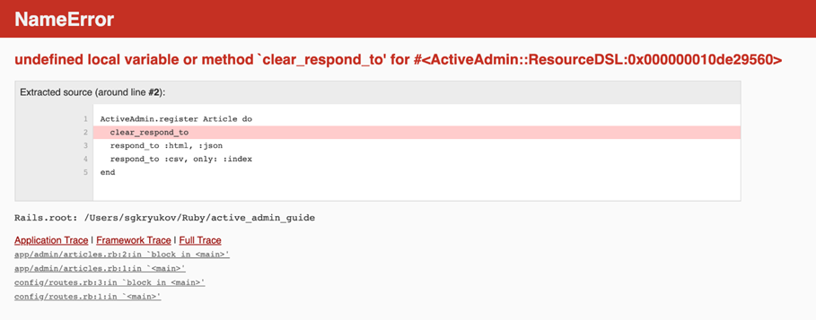

# 5.6.3 No Log to User

## Description
For web application security, it is crucial that **error details and exceptions are not exposed to end users**. Leaking information such as stack traces, system paths, or application structure can help attackers identify vulnerabilities. Ruby on Rails by default shows detailed error messages in the **development environment**, but this must be disabled in **production**.

---

## Example
In the development environment, Rails displays detailed error pages containing:

- The full exception message,
- A stack trace,
- A code preview of the failing location.

This behavior is useful for debugging but dangerous in production because it exposes internal details such as controller structure, file paths, and business logic.

This is controlled by a configuration setting in the environment config files (e.g., development):

<!-- Figure 125: Config enabling detailed error pages in development -->

When an error occurs, the user sees a detailed diagnostic error report:

<!-- Figure 126: Default error page in Rails development -->

---

## Mitigations
- **Do not expose error details in production.**
  In `config/environments/production.rb`, ensure that the option `consider_all_requests_local` is set to `false` (default in Rails). This prevents end users from accessing internal details.

<!-- Figure 127: Config disabling detailed error pages in production -->

When an error occurs in production, users will only see a generic error page with HTTP 500 status, without any sensitive information:

<!-- Figure 128: Default error page in Rails production -->

- **Log exceptions to external systems (e.g., Sentry).**  
  Logging errors in production logs may not be sufficient. Tools like **Sentry** [29] provide:
  - Real-time monitoring of exceptions,
  - Frequency analysis,
  - Automatic team notifications (via Slack, email, etc.).

Sentry can run as SaaS or self-hosted. It automatically captures unhandled exceptions, but manual reporting is also possible. With Sentry, errors are not only logged but actively monitored and easily accessible to the operations team.
