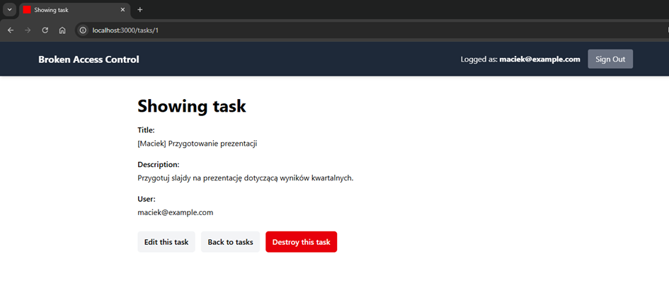
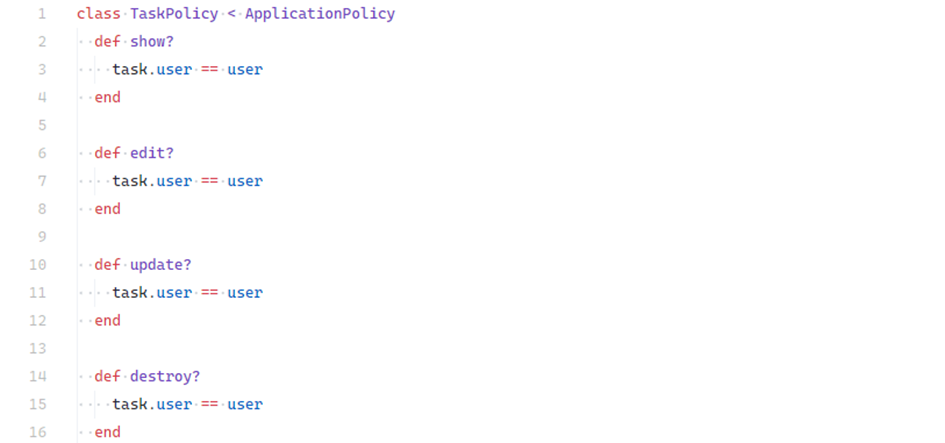
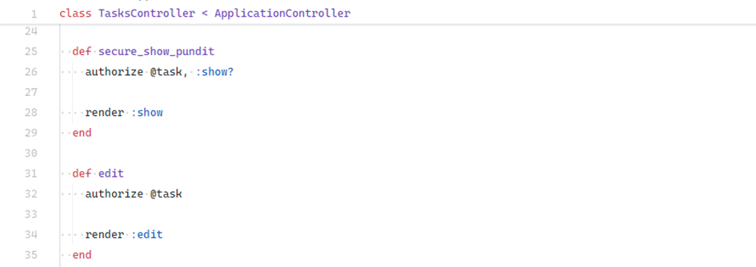
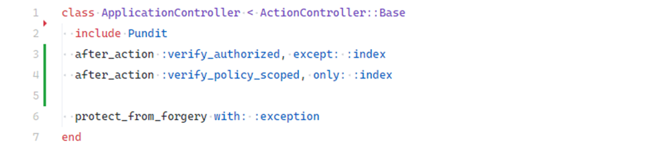

# Object Level Authorization (OLA)

## Description

**Object Level Authorization (OLA)** ensures that a user has the right permissions to perform an action on a specific resource.

Unlike **IDOR**, which is about missing ownership checks, OLA focuses on **dedicated authorization mechanisms** at the object level. In Rails, this is commonly implemented using libraries like **Pundit**, **CanCanCan**, or **ActionPolicy**.

---

## Example

Demo location:

```
ruby-on-rails-security/broken-access-control
```

Steps:

1. Log in as **[maciek@example.com](mailto:maciek@example.com)**.
2. You will see your own tasks.
   <!-- Figure 16: Logged-in user’s tasks -->
   
3. Just like in IDOR, try changing `/tasks/1` to `/tasks/6`.

   * Without OLA → you would see Tomek’s task.
   * With OLA enabled → access is denied.

### Task Policy

The `TaskPolicy` defines authorization rules for each action:

```ruby
class TaskPolicy < ApplicationPolicy
  def show?
    record.user_id == user.id
  end

  def edit?
    record.user_id == user.id
  end
end
```

<!-- Figure 17: TaskPolicy class -->


### Controller Integration

In the controller (`app/controllers/tasks_controller.rb`), Rails enforces authorization via `authorize`:

```ruby
def edit
  @task = Task.find(params[:id])
  authorize @task
end

def secure_show_pundit
  @task = Task.find(params[:id])
  authorize @task
end
```

<!-- Figure 18: Controller using authorize -->


If a user attempts to access a resource not belonging to them, the app responds with:

```
HTTP 403 Forbidden
```

<!-- Figure 19: 403 Forbidden error -->

---

## Impact

* Unauthorized viewing, editing, or deletion of other users’ resources.
* Bypassing access control logic in multi-layer applications.
* Permanent compromise of confidentiality and integrity of data.

---

## Mitigation

* Use dedicated authorization libraries: **Pundit**, **CanCanCan**, or **ActionPolicy**.
* Apply **deny by default**: every controller action should explicitly call `authorize`.
* Add global Pundit callbacks in `ApplicationController`:

```ruby
class ApplicationController < ActionController::Base
  include Pundit

  after_action :verify_authorized
end
```

<!-- Figure 20: Pundit configuration in ApplicationController -->


* Prefer declarative policies over ad-hoc conditional checks in controllers.
* Regularly test unauthorized access scenarios, including URL parameter tampering.

---
