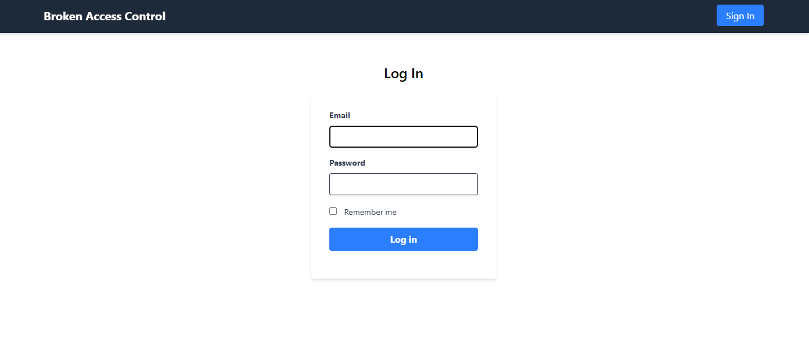
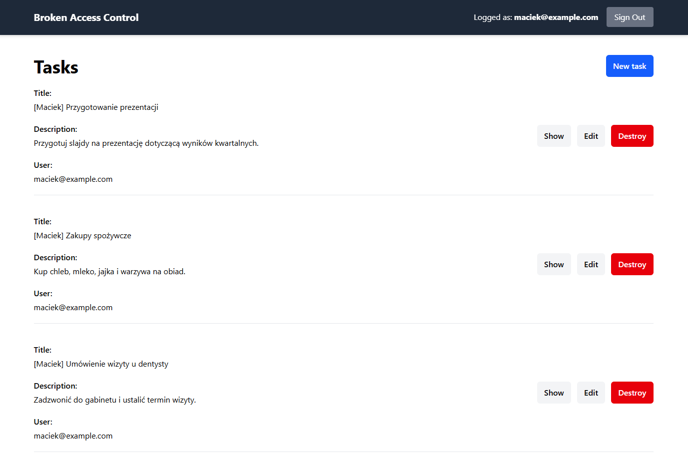
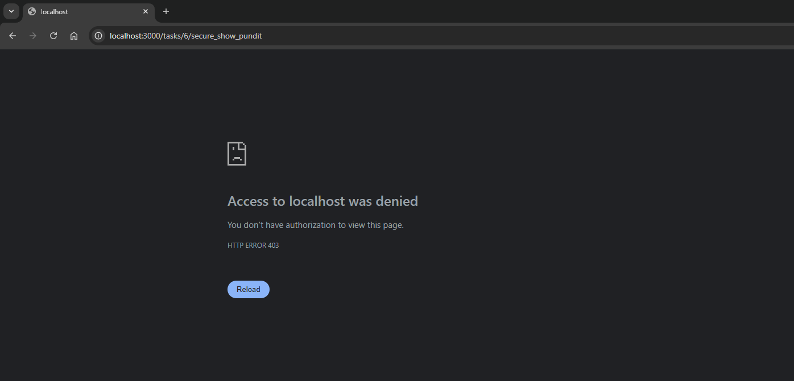
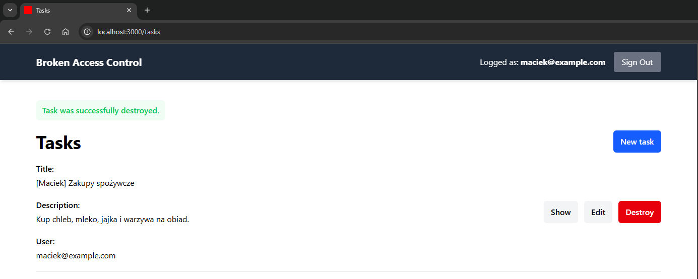

# Object Level Authorization (OLA)

Aplikacja dla tego przykładu znajduje się w katalogu `rails-security-lab/broken-access-control`.

https://github.com/maciejb2k/ruby-on-rails-security/tree/main/broken-access-control

## Przykład

Przyjrzyjmy się przykładowej aplikacji `broken-access-control`. Aplikacja ta pozwala na zarządzanie zadaniami. Użytkownik może zalogować się do aplikacji, dodać nowe zadanie, edytować zadanie, usunąć zadanie oraz zobaczyć listę zadań.



Analogicznie jak w przypadku podatności IDOR, mamy te same poczatkowe kroki postępowania.

Po zalogowaniu się jako użytkownik `maciek@example.com`, możemy zobaczyć liste jego wszystkich zadań:



Gdy wejdziemy w szczegóły zadania, widzimy, że należy ono na pewno do zalogowanego użytkownika i ma ono `id=1`.


Co gdybyśmy spróbowali zmienić `id` zadania w adresie URL na `6`?


Modyfikując adres URL, jesteśmy w stanie zobaczyć zadanie należące do użytkownika `tomek@example.com`.

W przeciwieństwie do IDOR, zamiast zawężać bezpośrednio zakres zwracanych wyników w kontrolerze, czytelniejszym i bezpieczniejszym rozwiązaniem jest sprawdzanie uprawnień na poziomie obiektu.

We frameworku Ruby on Rails wykorzystuje się do tego problemu gotowe narzędzia do autoryzacji, najlpopularniejszym z nich jest `Pundit`. W celu zabezpieczenia aplikacji, po zainstalowaniu tej paczki, należy dodać odpowiednią weryfikację dostępu za pomocą klasy polisy.

Przykład takiej polisy dla modelu `Task`:

```ruby
class TaskPolicy < ApplicationPolicy
  def show?
    task.user == user
  end

  def edit?
    task.user == user
  end

  def update?
    task.user == user
  end

  def destroy?
    task.user == user
  end

  class Scope
    attr_reader :user, :scope

    def initialize(user, scope)
      @user = user
      @scope = scope
    end

    def resolve
      scope.where(user: user)
    end
  end
end
```

W naszej aplikacji w kontrolerze akcje są zabezpieczone właśnie za pomocą tej polisy, która jest wywoływana w kontrolerze:

```ruby
class TasksController < ApplicationController
  ...

  def secure_show_pundit
    authorize @task, :show?

    render :show
  end

  ...
end
```

Przykład w jaki sposób są zabezpieczone inne akcje w kontrolerze za pomocą polisy:
```ruby
class TasksController < ApplicationController
  ...

  def index
    @tasks = policy_scope(Task)
  end

  def edit
    authorize @task

    render :edit
  end

  def update
    authorize @task

    if @task.update(task_params)
      redirect_to @task, notice: 'Task was successfully updated.', status: :see_other
    else
      render :edit, status: :unprocessable_entity
    end
  end

  def destroy
    authorize @task

    @task.destroy!
    redirect_to tasks_url, notice: 'Task was successfully destroyed.', status: :see_other
  end

  ...
end
```

Gdybyśmy spróbowali teraz wejść na stronę zadania, za pomoca bezpiecznej już metody `secure_show_pundit`, dostalibyśmy błąd `403 Forbidden`:



Dodatkowo, gdy użytkownik `maciek@example.com` chce usunąć swój zasób, to może to bez problemu zrobić:



Gdyby chciał usunąć zasób należący do użytkownika `tomek@example.com`, do którego uzyskał dostęp przez podatność IDOR w metodzie show, to nie bedzie w stanie wykonać żadnej innej akcji poza wyświetleniem, bo całą reszta akcji zabroniona jest przez polisę.
