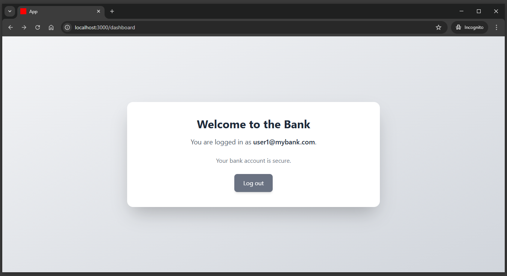
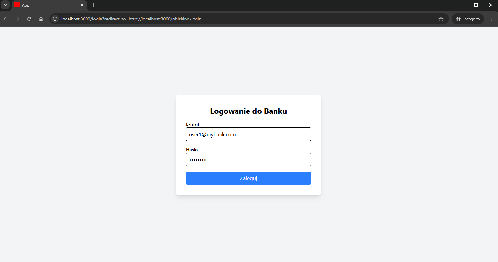
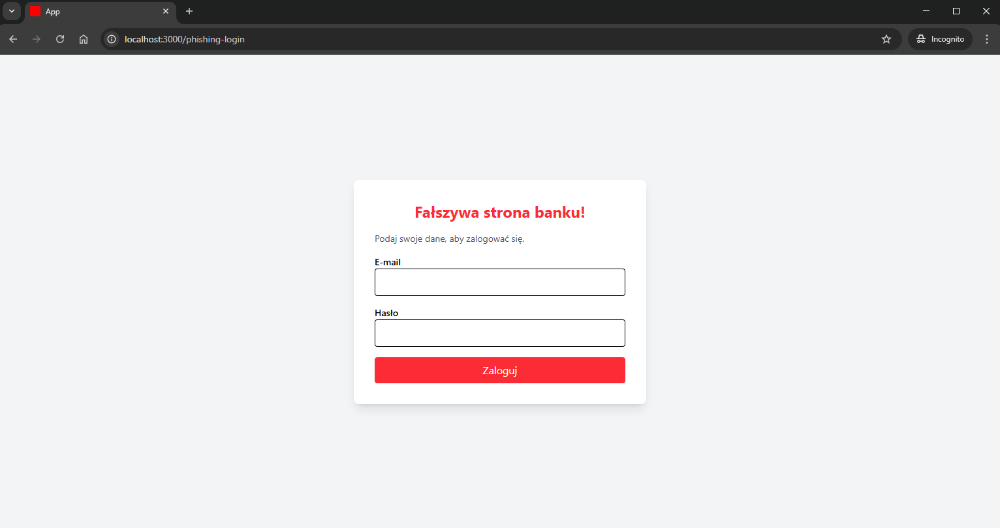

# Open Redirect

Aplikacja dla tego przykładu znajduje się w katalogu `rails-security-lab/insecure-design`.

https://github.com/maciejb2k/ruby-on-rails-security/tree/main/insecure-design

## Opis

**Open Redirect** - to podatność polegająca na braku walidacji adresu URL, na który użytkownik jest przekierowywany. Może to prowadzić do przekierowań na nieautoryzowane strony internetowe, często wykorzystywane w atakach phishingowych lub do omijania mechanizmów autoryzacji.

W aplikacjach webowych przekierowania są powszechne – np. po zalogowaniu użytkownik może być przekierowany na wcześniej odwiedzaną stronę, a w procesie płatności użytkownik może zostać przekierowany do zewnętrznego dostawcy usług płatniczych. Jeśli jednak aplikacja umożliwia atakującemu manipulację parametrami URL bez odpowiedniej walidacji, może to prowadzić do sytuacji, w której użytkownik zostanie przekierowany na stronę kontrolowaną przez atakującego.

W kontekście Ruby on Rails, podatność ta często pojawia się w metodzie `redirect_to`, która nie filtruje danych wejściowych, jeśli programista nie zadba o odpowiednie zabezpieczenia.

## Przykład

Przykład aplikacji logowania do banku ilustruje podatność Open Redirect. Aplikacja umożliwia użytkownikowi zalogowanie się poprzez standardowy formularz, w którym podaje swój e-mail i hasło. Po pomyślnym uwierzytelnieniu użytkownik jest przekierowywany na stronę główną konta (dashboard) lub inną stronę określoną w parametrze `redirect_to`.

Mechanizm ten pozwala użytkownikowi wrócić do poprzednio odwiedzanej strony po zalogowaniu.




Atakujący wykorzystuje podatność Open Redirect w przygotowanej dla przykładu aplikacji, aby przekierować użytkownika na fałszywą stronę logowania, która wygląda jak oryginalna. Dzięki temu może przechwycić dane logowania i przejąć konto użytkownika.

### Scenariusz Ataku

Atakujący tworzy złośliwy link i wysyła go (np. mailem) użytkownikowi.

```
http://localhost:3000/login?redirect_to=http://localhost:3000/phishing-login
```

Użytkownik widzi normalną stronę logowania (`/login`), więc nie podejrzewa zagrożenia.
Po zalogowaniu aplikacja automatycznie przekieruje go na `/phishing-login`, czyli stronę kontrolowaną przez atakującego.



Po poprawnym zalogowaniu użytkownik zostaje przekierowany na `/phishing-login`, ponieważ `redirect_to` nie zostało zweryfikowane. Użytkownik myśli, że coś poszło nie tak, bo widzi ponowny formularz logowania.

Nieświadomie wpisuje swoje dane ponownie – ale tym razem są one wysyłane bezpośrednio do atakującego. Wpisane dane użytkownika nie są wysyłane do aplikacji, ale do logów atakującego, który teraz posiada jego login i hasło. Atakujący może zalogować się na prawdziwe konto ofiary i np. zmienić hasło, zablokować użytkownika lub wykonać przelew.



## Skutki

1. **Phishing i kradzież danych** – użytkownicy mogą zostać przekierowani na fałszywe strony logowania, gdzie atakujący przechwytuje ich dane uwierzytelniające.
2. **Przechwycenie sesji i dostęp do konta** – atakujący może wykorzystać Open Redirect do kradzieży tokenów sesji, co pozwala na zalogowanie się bez hasła.
3. **Zainfekowanie użytkownika malware** – przekierowanie na stronę złośliwego oprogramowania może prowadzić do przejęcia kontroli nad urządzeniem ofiary.
4. **Spadek reputacji firmy i konsekwencje prawne** – wykorzystanie podatności w znanej marce może prowadzić do utraty zaufania klientów i problemów z regulacjami dotyczącymi ochrony danych.

## Zalecenia

Aby zabezpieczyć aplikację, należy:

### Nie używaj `redirect_to` z niesprawdzonym parametrem

Przekierowanie użytkownika za pomocą redirect_to params[:redirect_to] bez walidacji pozwala atakującemu na przekierowanie ofiary na złośliwą stronę (np. phishing). Aby temu zapobiec, należy upewnić się, że `redirect_to` akceptuje tylko ścieżki wewnętrzne i nie pozwala na pełne URL-e (np. zaczynające się od `http://` lub `https://`).

```ruby
redirect_to params[:redirect_to]
```

Bezpieczne przekierowanie:

```ruby
ALLOWED_PATHS = ["/dashboard", "/profile", "/settings"]

redirect_path = params[:redirect_to].to_s

if ALLOWED_PATHS.include?(redirect_path)
  redirect_to redirect_path
else
  redirect_to dashboard_path
end
```

### Sprawdzaj, czy przekierowanie prowadzi na dozwoloną domenę

Jeżeli aplikacja wymaga przekierowań na zewnętrzne strony (np. strony partnerów lub systemów autoryzacyjnych), należy upewnić się, że użytkownik może zostać przekierowany tylko do zaufanych domen. W przeciwnym razie atakujący może użyć Open Redirect do phishingu lub ataków XSS.

```ruby
ALLOWED_HOSTS = ["mybank.com", "secure.mybank.com"]

def safe_redirect
  uri = URI.parse(params[:redirect_to].to_s)

  if uri.host.nil? || ALLOWED_HOSTS.include?(uri.host)
    redirect_to uri.to_s
  else
    render plain: "Nieautoryzowane przekierowanie", status: :forbidden
  end
rescue URI::InvalidURIError
  render plain: "Błędny URL", status: :bad_request
end
```

### Używać listy dozwolonych domen lub ścieżek.

Najlepszym podejściem do kontroli przekierowań jest whitelistowanie (lista dozwolonych ścieżek), co oznacza, że użytkownik może być przekierowany tylko na określone podstrony aplikacji. Takie rozwiązanie jest bezpieczniejsze niż dynamiczna walidacja domen, ponieważ eliminuje ryzyko manipulacji URL-em.

```ruby
ALLOWED_PATHS = ["/dashboard", "/profile", "/settings"]

def create
  user = User.find_by(email: params[:email])

  if user && user.authenticate(params[:password])
    session[:user_id] = user.id
    redirect_path = params[:redirect_to].to_s

    if ALLOWED_PATHS.include?(redirect_path)
      redirect_to redirect_path
    else
      redirect_to dashboard_path
    end
  else
    flash[:alert] = "Nieprawidłowy e-mail lub hasło"
    render :new, status: :unprocessable_entity
  end
end
```
