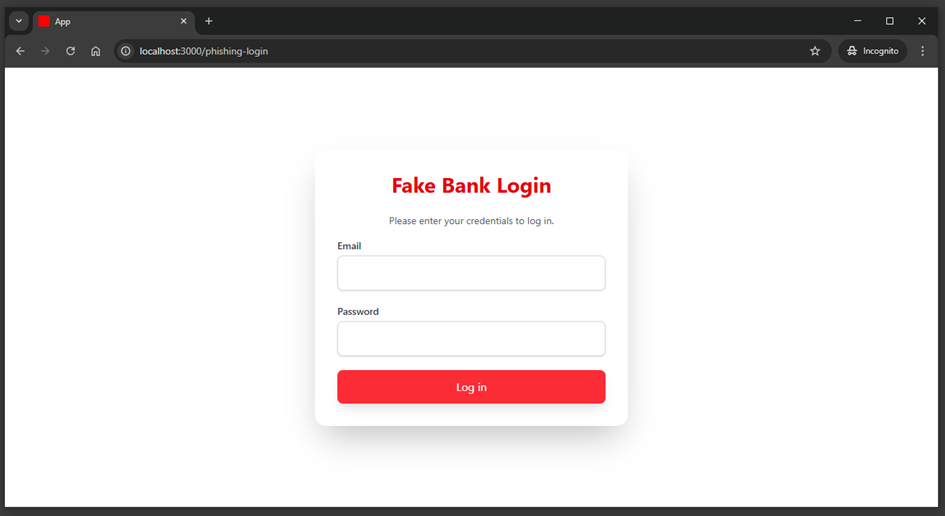
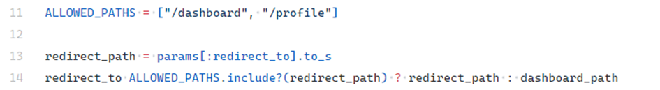

# Open Redirect

## Description

**Open Redirect** occurs when an application fails to validate the target URL for redirection. Attackers can manipulate request parameters to redirect users to malicious sites, often for phishing or bypassing authorization.

In Ruby on Rails, this typically happens with the `redirect_to` method when it uses unvalidated input.

---

## Example

Demo app location:

```
ruby-on-rails-security/insecure-design
```

Start the app and open:

```
http://localhost:3000
```

The app simulates a banking login flow:

* User logs in with email and password.
* After authentication, the app redirects to `/dashboard`, or to the URL provided in the `redirect_to` parameter.

### Normal flow

<!-- Figure 90: Login screen -->


<!-- Figure 91: Dashboard after successful login -->


### Attack scenario

Because the app does not validate the `redirect_to` parameter, an attacker can craft a malicious link:

<!-- Figure 92: Malicious link with redirect_to to phishing site -->


User logs in via the normal login screen, but the URL contains a hidden `redirect_to`:

<!-- Figure 93: URL bar showing malicious redirect_to parameter -->


After login, the victim is redirected to `/phishing-login` (controlled by the attacker):

<!-- Figure 94: Fake phishing login page -->


The victim re-enters credentials, which are stolen by the attacker.

---

## Impact

Unvalidated redirects can cause:

* **Phishing attacks** – redirecting to fake login forms to steal credentials.
* **Session hijacking** – attackers may capture session tokens during redirection.

---

## Mitigation

### Validate redirect parameters against allowed paths

Never use `redirect_to` with raw user input. If redirects depend on user-provided values, enforce a whitelist of allowed paths:

<!-- Figure 95: Example whitelist-based redirect protection -->


### Restrict external domains

If external redirects are required (e.g., payment gateways), validate the host against a list of trusted domains:

<!-- Figure 96: Example domain whitelist for safe redirects -->


---
