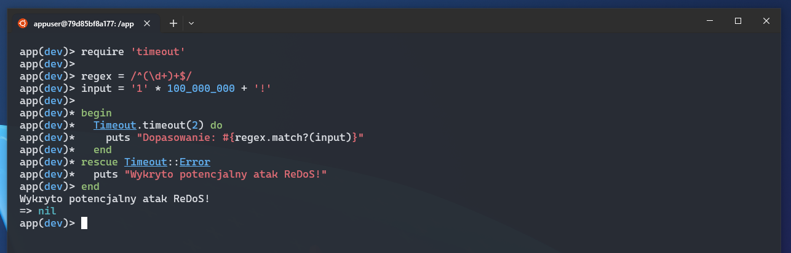

# Regular Expression Denial of Service (ReDoS)

## Opis

**Regex Denial of Service** (ReDoS) - to atak polegający na wykorzystaniu podatnych wyrażeń regularnych do spowodowania nadmiernego zużycia zasobów serwera. Dzieje się tak, gdy parser wyrażeń regularnych musi wykonać ogromną liczbę obliczeń z powodu nieefektywnej konstrukcji wzorca, zwłaszcza w przypadkach rekursywnych i zagnieżdżonych grup.

Atakujący dostarcza specjalnie przygotowane dane wejściowe, które powodują eksplozję kombinatoryczną w analizie wyrażenia regularnego. Powoduje to wysokie zużycie CPU i pamięci RAM, co może prowadzić do zawieszenia serwera lub jego całkowitej niedostępności.

Przykład podatnego wzorca:

```
/^(\d+)+$/
```

Wzorzec ten wygląda niewinnie, ale jeśli użytkownik poda ciąg znaków składający się z wielu powtórzeń, np. `111111111111111111111!`, silnik regex może wpadać w pętlę analizującą różne sposoby dopasowania, co prowadzi do dużego zużycia zasobów.

## Przykład

### Ruby

Poniżej znajduje się przykład kodu w Ruby, który ilustruje wpływ podatnego wyrażenia regularnego na wydajność.

```ruby
require 'timeout'

regex = /^(\d+)+$/
input = '1' * 100_000_000 + '!'

begin
  Timeout.timeout(2) do
    puts "Dopasowanie: #{regex.match?(input)}"
  end
rescue Timeout::Error
  puts "Wykryto potencjalny atak ReDoS!"
end
```

W powyższym kodzie ustawiamy limit czasu na 2 sekundy. Jeśli wyrażenie regularne napotka problem i przekroczy ten czas, skrypt zgłosi błąd `Timeout::Error`, co może sugerować, że regex jest podatny na ReDoS.



### Ruby on Rails

Podatność na ReDoS może pojawić się w walidacji modelu ActiveRecord, jeśli użyjemy niebezpiecznego wyrażenia regularnego do sprawdzania danych wejściowych użytkownika.

**Przykład podatnej walidacji w modelu:**

```ruby
class User < ApplicationRecord
  validates :username, format: { with: /^(\d+)+$/, message: "niepoprawny format" }
end
```

Wzorzec `/^(\d+)+$/` jest podatny na ReDoS, ponieważ dopasowanie do długich ciągów liczbowych może prowadzić do eksplozji kombinatorycznej.

Jeżeli użytkownik spróbuje ustawić sobie nazwę użytkownika na `111111111111111111111!`, to aplikacja może zostać zawieszona lub zablokowana, a na pewno zostanie mocno obciążona.

**Bezpieczna alternatywa:**

```ruby
class User < ApplicationRecord
  validates :username, format: { with: /^\d{1,10}$/, message: "może zawierać maksymalnie 10 cyfr" }
end
```

W tym przykładzie ograniczamy długość wprowadzanego ciągu do 10 cyfr, co eliminuje ryzyko ataku ReDoS.

## Skutki

Podatność na ReDoS może prowadzić do poważnych konsekwencji dla aplikacji webowych:
- **Zwiększone użycie CPU** – intensywne obliczenia na dużych danych wejściowych mogą zużywać zasoby serwera, prowadząc do spadku wydajności lub jego całkowitego zatrzymania.
- **Zawieszenie aplikacji** – jeśli atakujący dostarczy odpowiednio spreparowane dane, serwer może stać się niedostępny, a użytkownicy nie będą mogli korzystać z aplikacji.
- **Koszty operacyjne** – większe zużycie CPU i pamięci może zwiększać koszty operacyjne w chmurze.
- **Możliwość ataków DoS** – atakujący może celowo wysyłać żądania zawierające złośliwe ciągi znaków, co prowadzi do Denial of Service (DoS) i skutecznego unieruchomienia systemu.

## Zalecenia

### Nigdy nie tworzyć obiektu `Regexp` na podstawie danych wejściowych od użytkownika.

Tworzenie dynamicznych wyrażeń regularnych na podstawie danych wejściowych może prowadzić do ataków ReDoS, gdy atakujący dostarczy złośliwe wzorce. Zamiast tego, używaj statycznie zdefiniowanych wzorców i waliduj dane wejściowe przed ich użyciem.

### Przetworzyć wcześniej dane przed użyciem ich w wyrażeniach regularnych.

Sprawdzić długość ciągu znaków i zastosować odpowiednie ograniczenia. Nie bazować na walidacjach z frontendu. Warto także filtrować dane, np. ograniczać długość wejścia lub używać metod `start_with?`, `end_with?`, `include?` zamiast regexa, gdy to możliwe.

### Aktualizować na bieżąco wersje Ruby oraz Ruby on Rails.

Ruby od wersji `3.2.0` wprowadziło znaczną optymalizację wykonywania wyrazen regularnych oraz wprowadziło limit czasu na wykonywanie wyrażeń regularnych (globalnie i lokalnie) co pozwala na zabezpieczenie się przed ReDoS.

Przykład wydajności dla wersji Ruby `3.1.0` - 24 sekundy:
```ruby
:001 > require 'benchmark'
=> true
:002 > Benchmark.realtime { /^a*b?a*$/ =~ "a" * 50000 + "x" }
=> 24.171763999998802
```

Przykład wydajności dla wersji Ruby `3.2.0` - 0.007 sekundy:
```ruby
:001 > require 'benchmark'
=> true
:002 > Benchmark.realtime { /^a*b?a*$/ =~ "a" * 50000 + "x" }
=> 0.007867999986046925
```