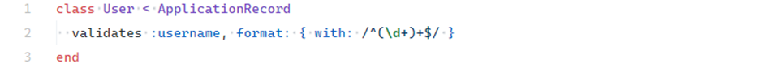

# Regex Denial of Service (ReDoS)

## Description

**Regex Denial of Service (ReDoS)** exploits inefficient regular expressions to overload a server. Vulnerability arises when regex patterns contain nested or recursive groups that lead to exponential backtracking. Attackers can supply crafted input strings that significantly increase regex processing time, consuming CPU and slowing down or freezing the application.

---

## Example

In Ruby on Rails, ReDoS can occur in model validations. For example, a vulnerable validation might use a pattern like:

<!-- Figure 97: Validation with unsafe regex ^(\d+)+$ -->


This pattern is susceptible to catastrophic backtracking. Input such as:

```
111111111111111111111!
```

forces millions of backtracking attempts, overloading the CPU.

A safer alternative is to constrain the allowed length:

<!-- Figure 98: Safer regex limiting username length to 1–10 digits -->


---

## Impact

ReDoS vulnerabilities can cause severe availability issues:

* **Application slowdown** – inefficient regex may consume 100% CPU.
* **Denial of Service (DoS)** – repeated crafted input can render the system unavailable.

---

## Mitigation

### Avoid regex from user input

Never create `Regexp` objects from untrusted input. Regex patterns should be static and predefined in code.

### Limit length and format before regex

Enforce maximum input length (e.g., `max_length`) before regex processing to prevent runaway backtracking.

### Keep Ruby and Rails updated

Since **Ruby 3.2.0**, regex execution time limits and optimizations reduce ReDoS risk. Always upgrade to recent versions.

* On older Ruby (< 3.2.0), unsafe patterns could block execution for **24+ seconds**.

  <!-- Figure 99: Benchmark of unsafe regex on older Ruby -->
  
* On Ruby 3.2.0+, the same input completes in milliseconds.

  <!-- Figure 100: Benchmark of unsafe regex on Ruby 3.2.0+ -->
  

---
