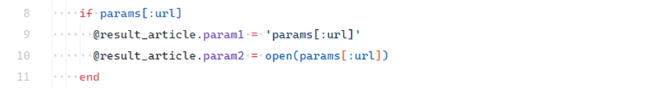
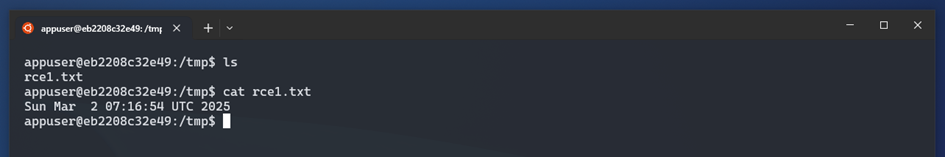
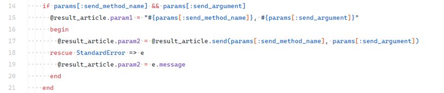
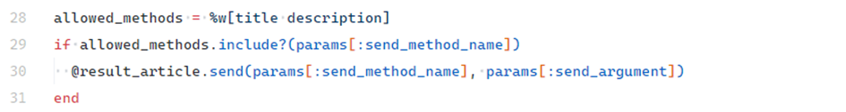

# Remote Code Execution (RCE)

## Description

**Remote Code Execution (RCE)** is a critical vulnerability that allows attackers to execute system commands remotely on the server. This can lead to full application compromise or unauthorized access to sensitive data.

In Ruby on Rails, RCE typically occurs due to unsafe handling of user input with methods like `open`, `send`, or `eval`, as well as unsafe deserialization of formats such as **YAML**, **Marshal**, or **JSON**.

---

## Examples

Demo app location:

```
ruby-on-rails-security/remote-code-execution
```

Start the app and open:

```
http://localhost:3000
```

The vulnerable app demonstrates multiple RCE scenarios in `ArticlesController`.

---

### RCE via `open`

Insecure use of Ruby’s `open` function:

<!-- Figure 44: Insecure use of open in controller -->


```ruby
# ❌ Insecure
open(params[:url])
```

Ruby’s `open` can:

* Read local files (`open("/etc/passwd")`)
* Fetch remote URLs (`open("http://example.com")`)
* Execute system commands if the input starts with `|`

Example malicious HTTP request:

<!-- Figure 45: Example malicious GET request -->


```
GET /articles?url=|echo "RCE test" > /tmp/rce1.txt
```

This executes a system command:

<!-- Figure 46: Executed system command -->


```bash
echo "RCE test" > /tmp/rce1.txt
```

Confirmation inside the container:

<!-- Figure 47: Entering the container -->


<!-- Figure 48: Confirming file creation from RCE -->


```bash
docker exec -it rails_app bash
cat /tmp/rce1.txt
```

⚠️ Never pass untrusted user input to `open`.

---

### RCE via `send`

Ruby’s `send` dynamically calls methods on objects:

```ruby
user.send("name")
user.send("greet", "Maciek")
```

Insecure implementation:

<!-- Figure 49: Insecure use of send in controller -->


```ruby
# ❌ Insecure
@result_article.send(params[:method], params[:arg])
```

Example malicious request:

<!-- Figure 50: Example malicious GET request -->


```
GET /articles?method=eval&arg=`echo RCE > /tmp/rce2.txt`
```

Executed code:

<!-- Figure 51: Code executed from injected params -->


```ruby
eval("`echo RCE > /tmp/rce2.txt`")
```

Terminal confirmation:

<!-- Figure 52: RCE confirmed in terminal -->


```bash
cat /tmp/rce2.txt
```

✅ Secure alternative: Restrict allowed methods to a whitelist.

<!-- Figure 53: Secure method whitelisting for send -->


```ruby
# ✅ Secure
allowed_methods = %w[title content]
if allowed_methods.include?(params[:method])
  @result_article.send(params[:method])
end
```

---

### RCE via Deserialization

Insecure deserialization can execute malicious code during object reconstruction. Dangerous methods:

* `Marshal.load`
* `YAML.unsafe_load`

Safer options:

* Use **JSON** for serialization.
* Use `YAML.safe_load` with explicit class whitelists.

---

## Impact

RCE is one of the most dangerous web application vulnerabilities. Potential consequences include:

* Full server compromise (system command execution).
* Theft of sensitive data (passwords, API keys, databases).
* Installation of malware (backdoors, ransomware).

---

## Mitigation

* **Validate and sanitize inputs** according to strict rules.
* **Avoid dynamic code execution** with `eval`, `send`, or `public_send`. If necessary, restrict to whitelisted methods.
* **Secure deserialization**: avoid `Marshal.load` and `YAML.unsafe_load`. Prefer JSON or `YAML.safe_load`.
* **Keep dependencies updated**: regularly update Ruby, Rails, and gems to patch known vulnerabilities.

---
