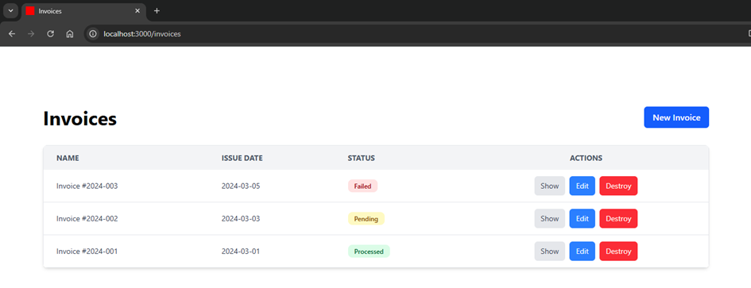
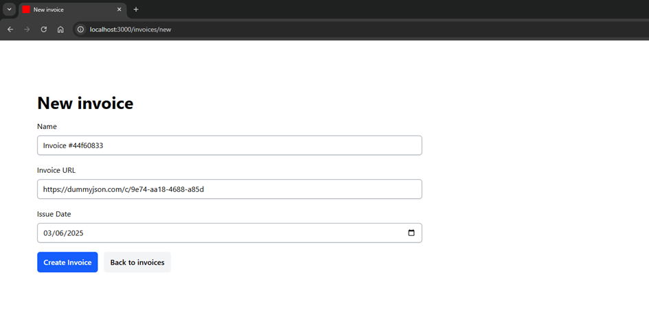
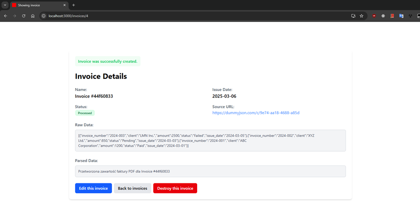
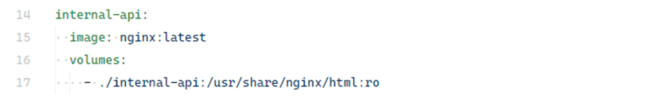
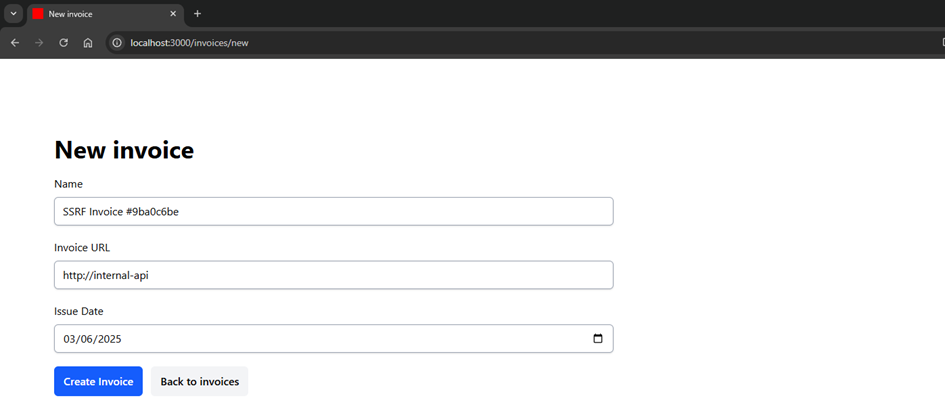
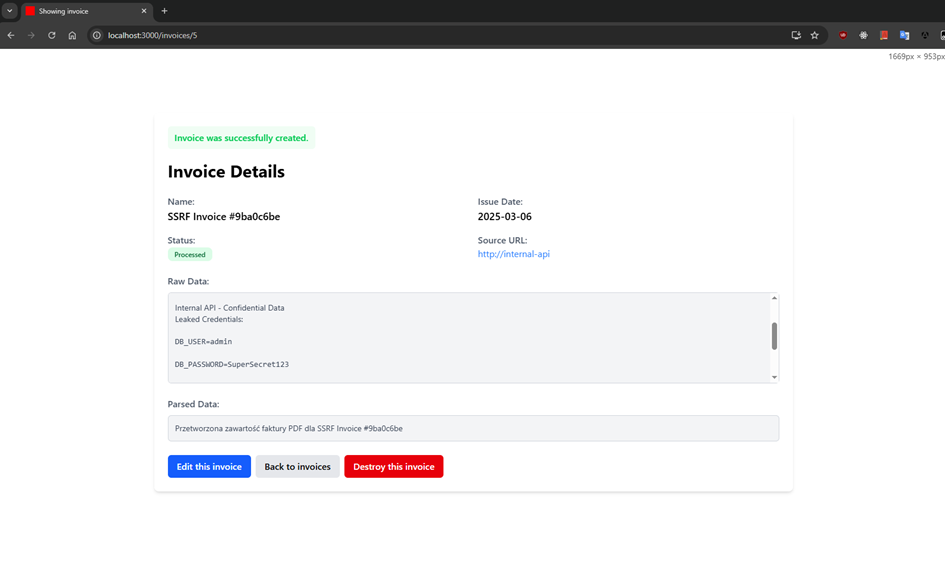

# 5.7.1 Server-Side Request Forgery (SSRF)

## Description

**Server-Side Request Forgery (SSRF)** is a vulnerability where the application server is tricked into making HTTP requests to resources chosen by the attacker (either internal or external). This can lead to disclosure of internal resources (e.g., admin panels, local APIs), infrastructure scanning, or even remote code execution.

In Ruby on Rails, SSRF can occur if the app allows users to provide a URL (e.g., for image preview, content loading, or API integration) and then performs a request using libraries like `Net::HTTP` or `Faraday` **without validating the target address**. Without validation, attackers may exploit this to access services reachable only within the server’s private network.

---

## Example

A demo application showcasing SSRF is located in:
`ruby-on-rails-security/server-side-request-forgery`

After starting the app, navigate to:

```
http://localhost:3000
```

The app allows users to provide a URL for fetching an invoice. It then processes the invoice and displays parsed information.

<!-- Figure 129: Homepage of invoice management app -->


**Normal behavior**
When clicking “New Invoice,” the user sees a form where they can enter a URL pointing to an invoice resource.

<!-- Figure 130: New invoice form with URL field -->


After processing, the app shows the fetched data in raw and parsed formats:

<!-- Figure 131: Invoice details after successful fetch -->


**Attack scenario**
An attacker can abuse this feature to probe internal services. For example, in a Docker Compose or Kubernetes setup, there may be services accessible only inside the cluster.

The system defines an internal service (`internal-app`) in `docker-compose.yml`, unreachable from outside:

<!-- Figure 132: Docker Compose config of internal service -->


If the attacker submits `http://internal-app` as the invoice URL:

<!-- Figure 133: Invoice form with internal service URL -->


The app performs the request and returns the response, exposing internal resources:

<!-- Figure 134: Successful SSRF attack exposing internal-api -->


---

## Risks

The impact of SSRF is particularly severe in **cloud and microservices environments**:

* **Exposure of internal services** — attackers may gain access to private APIs, databases, or admin panels.
* **Cloud metadata theft** — in AWS, for example, attackers may fetch credentials from `http://169.254.169.254`, leading to account takeover or privilege escalation.
* **Infrastructure reconnaissance** — attackers can map internal networks and services, enabling lateral movement.

---

## Mitigations

* **Validate user-provided URLs**
  Only allow URLs from a trusted whitelist of domains. Always parse and validate user input before making requests.

* **Block requests to local and private IPs**
  Disallow requests to internal ranges like `127.0.0.1`, `localhost`, `169.254.169.254`, or `192.168.0.0/16`. Resolve hostnames and check the resulting IP against forbidden ranges.

* **Isolate network logic**
  Offload external resource fetching to **dedicated microservices or workers** in isolated environments without access to internal networks. This limits the blast radius of potential SSRF attacks.
