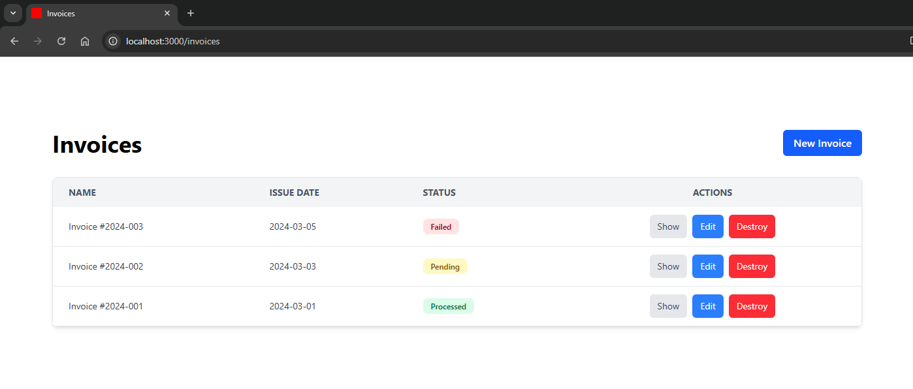
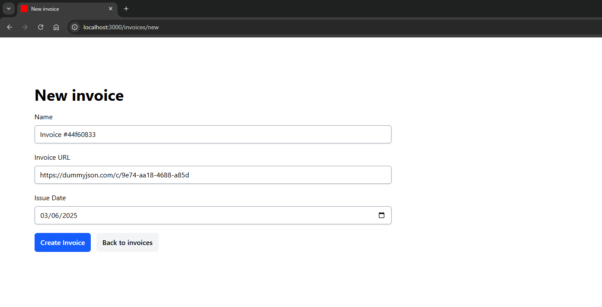
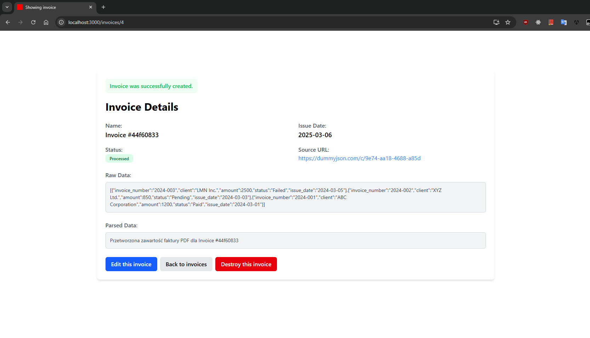
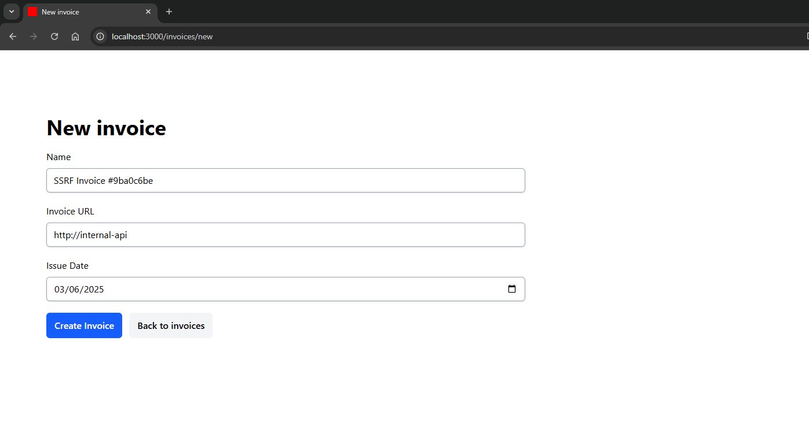

# Server-Side Request Forgery (SSRF)

Uruchomienie przykładowej aplikacji dla tej podatności:

```bash
# Aby uruchomić aplikację, wykonaj następującą komendę:
docker compose up -d

# Zatrzymanie aplikacji odbywa się za pomocą:
docker compose down

# W celu rozpoczęcia pracy od nowa (usunięcia wszystkich danych) użyj:
docker compose restart
```

## Opis

**Serwer-Side Request Forgery (SSRF)** -  to podatność bezpieczeństwa aplikacji webowych, w której atakujący może manipulować serwerem w taki sposób, aby wysyłał on nieautoryzowane żądania HTTP do wewnętrznych lub zewnętrznych zasobów.

SSRF często pojawia się, gdy aplikacja pozwala użytkownikowi na podanie adresu URL, a następnie wykonuje żądanie do tego adresu bez odpowiedniej walidacji. Może to prowadzić do ujawnienia wewnętrznych usług (np. baz danych, API), skanowania infrastruktury sieciowej, a w niektórych przypadkach – do zdalnego wykonania kodu.

W kontekście Ruby on Rails, SSRF może wystąpić np. w aplikacjach, które implementują funkcjonalność pobierania treści z zewnętrznych stron (np. podgląd linków, pobieranie obrazków czy integracja z API). Rails domyślnie oferuje metody takie jak `open-uri`, `Net::HTTP`, czy `RestClient`, które mogą być używane do wykonywania żądań HTTP. Jeśli aplikacja pozwala użytkownikowi na podanie URL-a bez odpowiedniego filtrowania, może to prowadzić do wykorzystania SSRF.

## Przykład

Aby zademonstrować podatność SSRF, przyjrzyjmy się przykładowej aplikacji, która umożliwia przesyłanie faktur za pomocą URL-a. Aplikacja pozwala użytkownikowi na podanie adresu URL, z którego pobierze fakturę, a nastepnie przetworzy ją i wyświetli kluczowe informacje użytkownikowi.

Na poniższym zrzucie ekranu widzimy wszystkie faktury w systemie:



## Poprawne działanie aplikacji

Po kliknięciu w przycisk "New Invoice" użytkownik może dodać nową fakturę, podając adres URL, z którego aplikacja pobierze fakturę:

Na potrzeby aplikacji adres URL jest losowo wygenerowanym endpointem, który po prostu zwraca jakieś dane w JSON, głównie dla celów demonstracyjnych. W rzeczywistości, podawalibyśmy adres URL do pliku PDF, który zawiera fakturę.



Po utworzeniu i przetworzeniu faktury, aplikacja wyświetla pobrane dane w surowej formie oraz w formie po przetworzeniu (również na cele demonstracyjne nie został zaimplementowany żaden parser faktur, tylko wyświetlany jest napis informujący o poprawnym pobraniu i przetworzeniu faktury):



## Przykład ataku

Załóżmy, że atakujący chce sprawdzić, czy wewnętrzna usługa jest dostępna w sieci. W tym celu atakujący może podać adres URL do wewnętrznej usługi, np. http://internal-app, która jest dostępna tylko w obrębie klastra aplikacji i jest niedostępna z zewnątrz.

Taki scenariusz jest jak najbardziej możliwy, ponieważ jeżeli aplikacja jest wystawiona za pomocą Docker Compose lub Kubernetes, kontenery lub pody komunikują się ze sobą za pomocą wewnętrznych adresów IP i wewnętrznego DNS, więc atakujący może próbować wykonać żądanie HTTP do wewnętrznej usługi.

W naszym przypadku jest wystawiona przez Docker Compose usługa `internal-app`, która jest dostępna tylko w obrębie klastra aplikacji.
```yaml
internal-api:
  image: nginx:latest
  volumes:
    - ./internal-api:/usr/share/nginx/html:ro
```

Podczas dodawania nowej faktury ataujący podaje adres URL do wewnętrznej usługi `http://internal-app`:



Po przetworzeniu faktury możemy zobaczyć, że aplikacja bez problemu pobrała dane z tej wewnętrznej usługi i wyświetliła je użytkownikowi jako surowe dane i doszło do wycieku danych.


## Skutki

Konsekwencje udanego ataku SSRF mogą obejmować:
- **Ujawnienie wewnętrznych usług** (bazy danych, API, systemy zarządzania),
- **Eksfiltrację metadanych chmurowych**, co prowadzi do przejęcia konta w chmurze,
- **Skanowanie i mapowanie infrastruktury sieciowej organizacji**,
- **Ominięcie mechanizmów uwierzytelniania**, jeśli aplikacja polega na adresach IP jako metodzie kontroli dostępu.

## Zalecenia

### Ograniczenie dostępu do wewnętrznych adresów

Blokowanie żądań do adresów `localhost`, `127.0.0.1`, `169.254.169.254` oraz innych adresów wewnętrznych pomaga zabezpieczyć aplikację przed próbami dostępu do usług wewnętrznych.

### Walidacja i filtrowanie adresów URL

Aplikacja powinna dopuszczać jedynie adresy URL z białej listy, uniemożliwiając użytkownikom wysyłanie zapytań do nieautoryzowanych domen.

### Poprawna implementacja w Ruby on Rails

Poniżej znajduje się podatny kod z aplikacji, który pozwala na wykonanie ataku SSRF:

```ruby
file = URI.open(@invoice.url)
file_content = file.read
```

Taki kod może prowadzić do ataków SSRF. Poprawna implementacja powinna zawierać walidację adresu URL przed wykonaniem żądania HTTP:

```ruby
require 'resolv'

def valid_url?(url)
  uri = URI.parse(url)

  # Sprawdzamy, czy URL jest HTTP(S)
  return false unless uri.is_a?(URI::HTTP)

  ip = Resolv.getaddress(uri.host)

  # Lista zaufanych domen
  allowed_domains = ["example.com", "trusted-source.com"]

  # Jeśli domena jest na whiteliście, jest bezpieczna
  return true if allowed_domains.include?(uri.host)

  # Sprawdzenie, czy adres IP należy do zakresów prywatnych
  private_ip_ranges = [
    IPAddr.new('127.0.0.1/8'),      # localhost
    IPAddr.new('10.0.0.0/8'),       # prywatna sieć A
    IPAddr.new('172.16.0.0/12'),    # prywatna sieć B
    IPAddr.new('192.168.0.0/16'),   # prywatna sieć C
    IPAddr.new('169.254.0.0/16')    # metadane AWS
  ]

  private_ip_ranges.each do |range|
    return false if range.include?(ip)
  end

  true
rescue URI::InvalidURIError, Resolv::ResolvError
  false
end
```