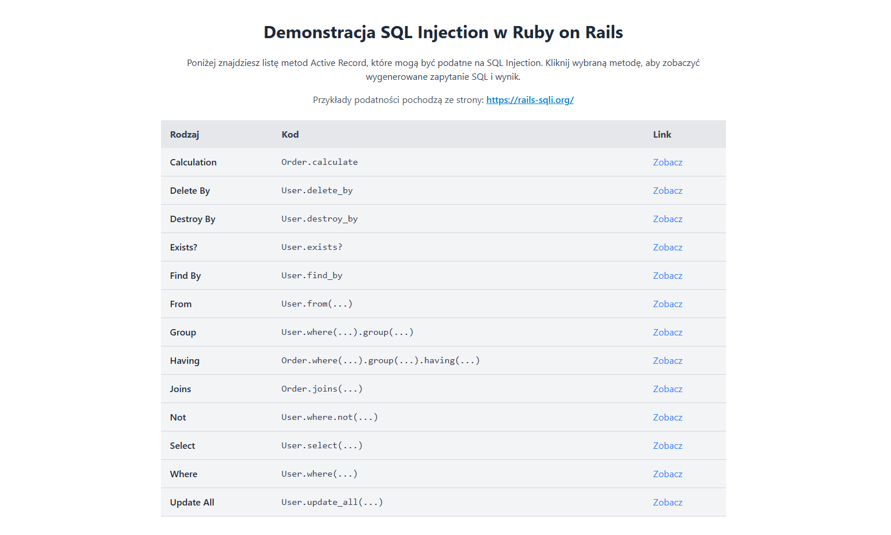
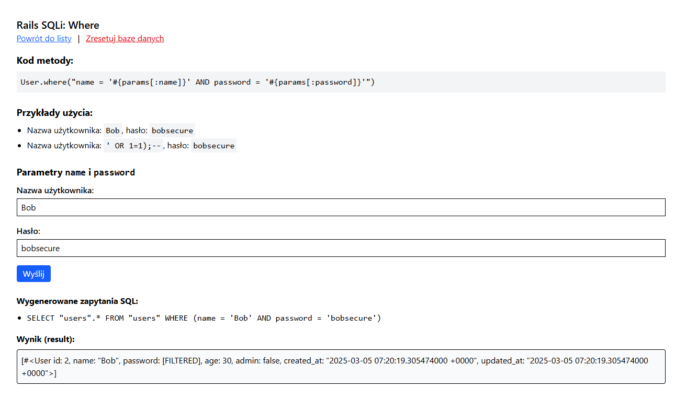
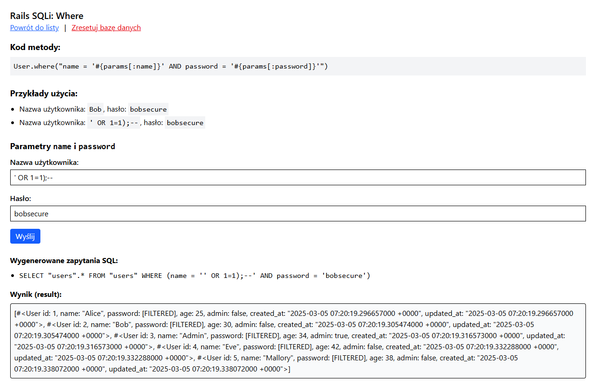

# SQL Injection (SQLi)

```bash
# Aby uruchomić aplikację, wykonaj następującą komendę:
docker compose up -d

# Zatrzymanie aplikacji odbywa się za pomocą:
docker compose down

# W celu rozpoczęcia pracy od nowa (usunięcia wszystkich danych) użyj:
docker compose restart
```

## Opis

**SQL Injection** (wstrzyknięcie SQL) to jedna z najczęstszych i najniebezpieczniejszych podatności w aplikacjach webowych. Polega na takim przekazaniu danych wejściowych użytkownika (najczęściej w parametrach żądania HTTP), by końcowe zapytanie SQL wysłane do bazy danych zostało zmodyfikowane w sposób niezamierzony przez twórcę aplikacji. Atakujący może w ten sposób odczytać, zmodyfikować lub nawet usunąć dane, wykraczając poza dozwolone przez logikę biznesową operacje.

W kontekście Ruby on Rails do komunikacji z bazą danych używany jest głównie **Active Record** – warstwa **ORM** (Object-Relational Mapping). W większości przypadków Rails chroni przed SQL Injection, jeżeli korzysta się z parametryzowanych i kontrolowanych wywołań w stylu:

```ruby
User.where(id: params[:id])
# lub
User.where("id = ?", params[:id])
```

Natomiast podatność może wystąpić wtedy, gdy programista samodzielnie wstawia w zapytaniu surowe fragmenty SQL z parametrami pochodzącymi od użytkownika. Przykładem może być:

```ruby
User.where("id = #{params[:id]}")
```

W powyższym kodzie Rails dosłownie wkleja params[:id] w treść zapytania SQL, co może pozwolić atakującemu na wprowadzenie dodatkowych warunków, klauzul OR, komentarzy, a nawet złośliwych podzapytan w stylu:

```sql
1) OR 1=1--
```

Skutkuje to np. odczytaniem większej liczby rekordów lub modyfikacją danych, do których atakujący normalnie nie miałby dostępu.

## Przykład

Na potrzeby pracy magisterskiej powstała przykładowa aplikacja Rails z wieloma akcjami, które w niepoprawny sposób łączą dane wejściowe użytkownika z fragmentami SQL. Aplikacja opiera się na bazie danych PostgreSQL.



Aplikacja zawiera m.in. dwa modele z przygotowanymi do testów zaseedowanymi danymi:
- `User` (kolumny:`name`, `password`, `age`, `admin`)
- `Order` (kolumny: `user_id`, `total`)

W pliku kontrolera (`InjectionsController`) zdefiniowano kilkanaście akcji, np. `calculation`, `delete_by`, `where`, `select`, itp., które demonstrują różne sposoby „wstrzykiwania” złośliwych fragmentów SQL w metody Active Record. Każda akcja ma odpowiadający jej widok z krótkim formularzem pozwalającym wpisać własne dane wejściowe (parametry).

Przyjrzyjmy się dokładniej jednemu przykładowi dla akcji `where`.

Każdy przykład jest skonstrowany w taki sam identyczny sposób i składa się z następujących elementów:
- **Przycisk "Zresetuj bazę danych"** - umożliwiającego natychmiastowe przywrócenie bazy danych do stanu początkowego z zaseedowanymi danymi.
- **Sekcja "Kod metody"** - pokazuje, jak w kontrolerze wywołuje się metodę Active Record. Wskazuje potencjalne miejsce niebezpiecznego sklejania danych użytkownika z fragmentem zapytania SQL.
- **Sekcja "Przykłady użycia"** - prezentuje podpowiedzi wartości pól formularza (np. name, password), w tym przykłady poprawnych wartości i złośliwych inputów (np. `' OR 1=1)--`).
- **Sekcja formularza** - Tutaj użytkownik wprowadza parametry, które aplikacja wstawi bezpośrednio do zapytania SQL.
-** Sekcja "Wygenerowane zapytania SQL"** - przedstawia jak Ruby on Rails skonstruował zapytania SQL, z uwzględnieniem potencjalnie wstrzykniętego fragmentu.
- **Pokazanie wyniku** - Aplikacja wyświetla wynik działania zapytania, może to być obiekt/rekord bazy danych lub tablica rekordów, wylistowana metodą inspect. Jeśli nic nie zwróciło zapytanie (bądź nie wykonano go), pojawi się komunikat "Brak dostępnych wyników".

Na poniższym zrzucie ekran możemy zobaczyć, jak wygląda wynik działania przykładu dla poprawnie podanych parametrów `name` i `password`.



Wygenerowane zapytanie SQL:
```sql
SELECT "users".* FROM "users" WHERE (name = 'Bob' AND password = 'bobsecure')
```

Wynik zapytania:
```ruby
[#<User id: 2, name: "Bob", password: [FILTERED], age: 30, admin: false, created_at: "2025-03-05 07:20:19.305474000 +0000", updated_at: "2025-03-05 07:20:19.305474000 +0000">]
```

Co jeżeli zamiast poprawnych danych wprowadzimy złośliwe wartości?



Jeżeli jednak wprowadzimy złośliwe wartości, czyli zamiast hasła podamy `' OR 1=1)--`, to zapytanie SQL wyglądać będzie następująco:

```sql
SELECT "users".* FROM "users" WHERE (name = 'Bob' AND password = '' OR 1=1);--')
```

W rezultacie zapytanie zwróci wszystkie rekordy z tabeli `users`, a nie tylko te, które spełniają warunki `name = 'Bob' AND password = 'bobsecure'`, ponieważ warunek `1=1` jest zawsze prawdziwy.
```ruby
[#<User id: 1, name: "Alice", password: [FILTERED], age: 25, admin: false, created_at: "2025-03-05 07:20:19.296657000 +0000", updated_at: "2025-03-05 07:20:19.296657000 +0000">, #<User id: 2, name: "Bob", password: [FILTERED], age: 30, admin: false, created_at: "2025-03-05 07:20:19.305474000 +0000", updated_at: "2025-03-05 07:20:19.305474000 +0000">, #<User id: 3, name: "Admin", password: [FILTERED], age: 34, admin: true, created_at: "2025-03-05 07:20:19.316573000 +0000", updated_at: "2025-03-05 07:20:19.316573000 +0000">, #<User id: 4, name: "Eve", password: [FILTERED], age: 42, admin: false, created_at: "2025-03-05 07:20:19.332288000 +0000", updated_at: "2025-03-05 07:20:19.332288000 +0000">, #<User id: 5, name: "Mallory", password: [FILTERED], age: 38, admin: false, created_at: "2025-03-05 07:20:19.338072000 +0000", updated_at: "2025-03-05 07:20:19.338072000 +0000">]
```

Tak skonstruowana aplikacja jawnie demonstruje zjawisko SQL Injection w Rails – wystarczy niechcący wykorzystać metodę typu `calculate`, `where("...")`, `select("...")`, `joins("...")`, i scalić parametry od użytkownika bez ich odpowiedniego zparametryzowania.

## Skutki

Konsekwencje wystąpienia SQL Injection w aplikacji Rails mogą być niezwykle poważne:
- **Wycieki danych poufnych** – atakujący może odczytywać dane z innych tabel (np. hasła, dane osobowe, numery kart).
- **Uszkodzenie lub usunięcie danych** – przez wstrzyknięcie klauzul typu `DELETE`, `DROP TABLE`, `TRUNCATE`, itp.
- **Nieautoryzowany dostęp** – np. podniesienie uprawnień własnego konta przez zmianę kolumny `admin` na `true`.
- **Ataki łańcuchowe** – jeżeli baza danych pozwala na wykonywanie funkcji systemowych, atakujący może eskalować atak na cały serwer.

## Zalecenia

### 1. Nigdy nie doklejaj do zapytań SQL nieznanych fragmentów łańcucha znaków

Choć w przykładach używamy `params[:name]` jako danych wejściowych od użytkownika, to samo ryzyko istnieje, gdy „doklejasz” do SQL cokolwiek, czego **nie masz pod pełną kontrolą** (zmienne środowiskowe, zewnętrzne dane JSON, itp.). Wszelkie treści, które nie są statycznie zapisane w kodzie, powinny być traktowane jako potencjalnie niebezpieczne.

### 2. Używaj zapytań parametryzowanych zamiast konkatencaji stringów.

Na podstawie powyższego przykładu dla `where`, zamiast tworzyć zaptyanie w stylu:
```ruby
User.where("name = '#{params[:name]}' AND password = '#{params[:password]}'")
```

używaj:

```ruby
User.where("name = ? AND password = ?", params[:name], params[:password])
```

albo jeszcze bezpieczniejszego podejścia z hashami:

```ruby
User.where(name: params[:name], password: params[:password])
```

Używanie zapytań parametryzowanych w Rails chroni przed atakami SQL Injection, ponieważ wartości parametrów są przekazywane do bazy w sposób bezpieczny, a nie jako część ciągu zapytania. Dzięki temu baza danych traktuje je jako dane, a nie jako część kodu SQL, eliminując ryzyko wstrzyknięcia złośliwych komend.

W przypadku podejścia z hashasmi Rails automatycznie zamienia parametry na bind variables (`?`) i bezpiecznie przekazuje zapytanie do bazy.

### 3. Waliduj i ograniczaj dynamiczne fragmenty zapytań do ściśle kontrolowanych wartości

Jeśli faktycznie musisz przekazywać np. nazwę kolumny lub tabeli, zadbaj o to, by pochodziła z białej listy (zbioru dozwolonych i przewidywalnych wartości).

Przykładowo, jeśli użytkownik decyduje, po której kolumnie sortować, to najpierw sprawdź, czy podana kolumna znajduje się w dozwolonej liście:

```ruby
ALLOWED_COLUMNS = %w[created_at name age total]

sort_column = ALLOWED_COLUMNS.include?(params[:sort]) ? params[:sort] : "name"
@users = User.order(sort_column)
```

W ten sposób eliminujesz możliwość wstrzyknięcia klauzul w stylu `"; DROP TABLE users; --"`.

### 4. Stosuj zasady parametryzacji również poza typowymi polami formularzy

W aplikacji demonstracyjnej widzimy przykłady, w których `params[:column]` trafia bezpośrednio do `Order.calculate(...)`, a `params[:from_param]` do `User.from(...)`. Nawet jeśli dane nie pochodzą z typowego formularza HTML, traktuj je z taką samą ostrożnością.

Wszelkie dynamiczne wartości – nieważne, czy zostały pobrane z API, pliku czy dedykowanego panelu administracyjnego – powinny być walidowane i parametryzowane (lub zastępowane sprawdzoną listą dopuszczalnych wartości).


