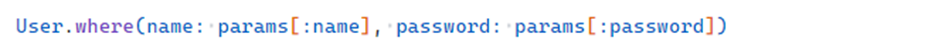

# SQL Injection (SQLi)

## Description

**SQL Injection (SQLi)** occurs when untrusted user input is inserted directly into SQL queries. Attackers can read, modify, or delete data while bypassing authorization and application logic.

In Ruby on Rails, database operations are typically performed via **Active Record** \[24], which provides strong protection when used correctly. Secure usage examples:

<!-- Figure 79: Safe ActiveRecord where examples -->


The vulnerability arises when developers manually construct SQL fragments with interpolated user input:

<!-- Figure 80: Insecure ActiveRecord where examples -->


Example payload: `1 OR 1=1--` returns all users regardless of authorization.

---

## Example

Demo app location:

```
ruby-on-rails-security/sql-injection
```

Start the app and open:

```
http://localhost:3000
```

The homepage illustrates vulnerable and safe Active Record methods.

<!-- Figure 81: Demo app showing ActiveRecord methods (safe vs unsafe) -->


The core controller, `InjectionsController`, contains multiple actions (`where`, `select`, `join`, `calculate`, `delete_by`) with intentional vulnerabilities.

Database schema:

* `users (name, password, age, admin)`
* `orders (user_id, total)`

Each view demonstrates:

* Reset button to restore database with seeds.
* Controller code snippet (showing vulnerability).
* Example malicious inputs.
* Form to inject SQL.
* Generated SQL query.
* Query result output.

### Example: `where`

Normal query:

<!-- Figure 82: Demo view with valid parameters -->


<!-- Figure 83: Generated SQL for valid input -->


<!-- Figure 84: Query result for valid SQL -->


Malicious query:

Input: `' OR 1=1)--`

<!-- Figure 85: Generated SQL for malicious input -->


<!-- Figure 86: Demo view showing SQLi result with all users returned -->


Other vulnerable methods include `select("...")`, `joins("...")`, `calculate("...")`, etc.

---

## Impact

SQLi in Rails can cause:

* **Data theft** – passwords, personal info, payment data.
* **Data manipulation or deletion** – e.g., `DELETE`, `DROP TABLE`, `TRUNCATE`.
* **Privilege escalation** – bypassing authentication and gaining admin access.

---

## Mitigation

### Avoid dynamic SQL

Never directly concatenate user input into queries. This applies to all external data sources: params, files, JSON, environment variables, API responses.

### Use parameterized queries

Instead of:

<!-- Figure 87: Insecure ActiveRecord query -->


Use parameter binding:

<!-- Figure 88: Safe ActiveRecord query with parameters -->


Or hashes (most readable in Rails):

<!-- Figure 89: Safe ActiveRecord query using hashes -->


ActiveRecord automatically escapes parameters as **bind variables**, preventing SQL injection.

### Restrict dynamic fragments

If dynamic SQL fragments are unavoidable (e.g., sort column), enforce a strict whitelist of allowed values.

---
