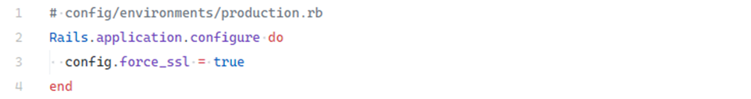
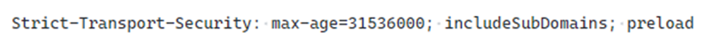
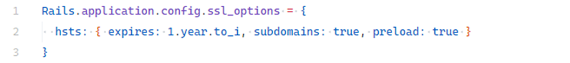

# TLS Enforcement / HSTS

## Description

Lack of encryption between the browser (client) and the server exposes users to interception of sensitive data such as passwords or session identifiers. Without TLS and proper hardening, attackers can exploit insecure traffic flows and compromise user accounts.

---

## Impact

Improper TLS configuration or missing enforcement can result in severe security issues:

* **No HTTPS enforcement** – if the app accepts HTTP connections, attackers can perform **Man-in-the-Middle (MITM)** attacks. Tools like Wireshark can sniff plaintext traffic and steal passwords, tokens, or personal data. Missing **HSTS** support further enables **SSL Stripping** attacks (downgrading HTTPS to HTTP).
* **Sensitive data in URLs** – session tokens or reset credentials sent via URL parameters may end up in server logs, browser history, or `Referer` headers.
* **Missing Secure and HttpOnly cookie flags** – allows cookies to be sent over unencrypted HTTP or accessed by JavaScript, enabling **XSS** and **session hijacking**.
* **Unencrypted request bodies** – transmitting credit card numbers or personal data in plaintext risks financial theft and identity compromise.
* **Infrastructure misconfiguration (proxy / load balancer)** – even if Rails enforces HTTPS, misconfigured reverse proxies may terminate TLS early and pass unencrypted traffic internally.

---

## Mitigation

### Enforce HTTPS in Rails

The primary step is to ensure **all traffic** is over HTTPS. In Rails, use the `config.force_ssl` option (set in the environment config file):

<!-- Figure 111: Rails config forcing HTTPS in production -->

* **Standalone apps (e.g., VPS, bare server):** `force_ssl = true` automatically redirects HTTP → HTTPS, sets the **Secure** flag for cookies, and enables **HSTS**.
* **Apps behind reverse proxies/load balancers (e.g., Kubernetes, NGINX Ingress, Traefik):**

  * Enforce redirects and HSTS at the proxy layer.
  * Manually configure cookies with `secure: true`, `httponly: true`, `same_site: :strict`.
  * Ensure Rails correctly receives headers like `X-Forwarded-Proto` to detect HTTPS.

### Avoid sensitive data in URLs

Never send secrets (e.g., tokens, reset links, session IDs) as query parameters. URLs are often logged, cached, or shared. Use **HTTP headers** or the **request body** instead.

### Enable HSTS

**HTTP Strict Transport Security (HSTS)** forces browsers to always use HTTPS, even when users type `http://`. It protects against MITM and SSL Stripping attacks.

Example header:

<!-- Figure 112: Example HSTS header -->

Rails automatically adds HSTS when `config.force_ssl` is enabled. For advanced control, customize HSTS in the environment config:

<!-- Figure 113: Example custom HSTS configuration -->

**Best practices:**

* Start with a low `max-age` during testing.
* Ensure all assets and subdomains support HTTPS.
* Regularly monitor TLS certificate validity.
