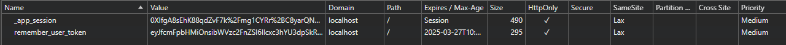

# Token / Cookie Misconfiguration

Aplikacja dla tego przykładu znajduje się w katalogu `broken-access-control`.

https://github.com/maciejb2k/ruby-on-rails-security/tree/main/broken-access-control

