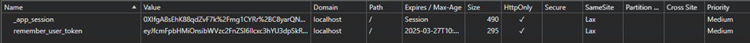
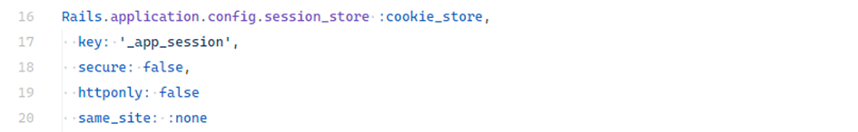
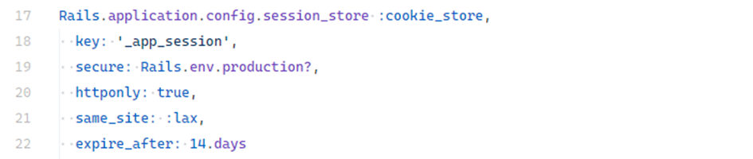

# Token / Cookie Misconfiguration

## Description

Misconfigured tokens and cookies can lead to severe security risks such as **session hijacking**, **CSRF**, **XSS**, or unauthorized data access. Common mistakes include missing `Secure`, `HttpOnly`, or `SameSite` flags, overly long cookie lifetime, or storing sensitive data without proper encryption.

---

## Example

In web applications, sessions allow persisting user data across HTTP requests. In Ruby on Rails, sessions can be stored either in cookies or on the server side.

Rails provides two main session storage mechanisms:

* **CookieStore (default)** – stores the encrypted session directly on the client side in a cookie.
* **CacheStore, MemCacheStore, ActiveRecordStore** – store the session server-side, with only the session ID kept in the cookie.

Consider a sample Rails app using **Devise** and default session configuration. After login, you can observe the session cookie in the browser developer tools:

<!-- Figure 105: Rails session cookie view in browser developer tools -->

Key observations:

* Entire session is stored client-side (`CookieStore`).
* Cookie name is usually `_app_session`, where `app` is derived from the application name.
* Cookie is **signed** and **encrypted**.
* `HttpOnly` is enabled by default.
* `SameSite` is set to **Lax**.
* `Secure` flag is missing by default.

By default, Rails session cookies are:

* **Signed** → prevents tampering (integrity).
* **Encrypted** → prevents reading the content (confidentiality).

---

## Impact

An example of insecure cookie configuration:

<!-- Figure 106: Example of insecure Rails session cookie configuration -->

Consequences of missing flags:

* **Session hijacking** – without `Secure`, cookies may be sent over HTTP, exposing them to interception on insecure networks.
* **XSS attacks** – without `HttpOnly`, cookies are accessible to JavaScript (`document.cookie`), enabling theft via malicious scripts.
* **CSRF** – with `SameSite: none`, cookies are sent cross-site, allowing attackers to forge requests.

---

## Mitigation

### Explicit and secure cookie/session configuration

HTTP cookies should be configured with proper attributes:

* **Expires / Max-Age** – defines cookie lifetime. If not set, cookie expires when the browser is closed.
* **Domain** – specifies domain scope.
* **Path** – restricts availability to specific paths (e.g., `/admin`).
* **SameSite** – controls cross-site behavior:

  * `Strict` – cookie sent only within same domain.
  * `Lax` – default in Rails, sent for safe requests like `GET`.
  * `None` – cookie always sent, requires `Secure`.
* **Secure** – ensures cookies are transmitted only over HTTPS.
* **HttpOnly** – prevents access from JavaScript, protecting against XSS.

In production, configure session cookies explicitly in `config/environments/production.rb`:

<!-- Figure 107: Example of secure Rails cookie configuration in production -->

### Choosing the right session store

**CookieStore**:

* ✅ Simple and fast.
* ✅ No external system required.
* ❌ Limited to \~4KB.
* ❌ Cannot revoke individual sessions (all share same key).

**ActiveRecordStore / CacheStore**:

* ✅ Centralized session management.
* ✅ Supports revoking individual sessions (e.g., after password reset).
* ✅ No strict size limitation.
* ❌ Requires extra configuration and cleanup.

For smaller apps, **CookieStore** is sufficient. For larger systems or advanced session control, consider **ActiveRecordStore** or **CacheStore**.
