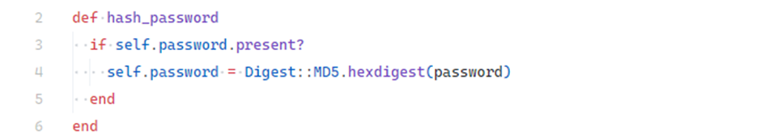
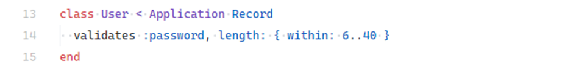
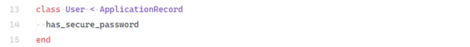
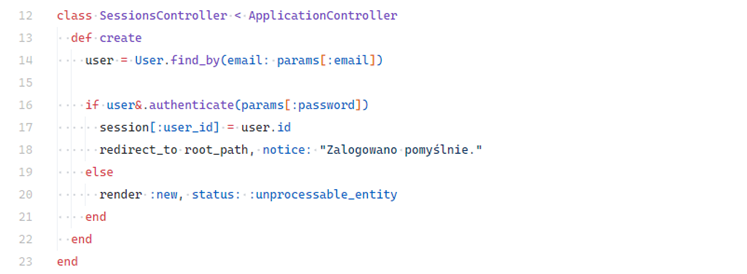

# Weak Encoding for Password

## Description

This vulnerability occurs when user credentials are stored improperly, drastically lowering application security.

Storing passwords in plain text or using weak hashing algorithms exposes users to **dictionary attacks**, **brute-force attacks**, and **rainbow table attacks**.

In Ruby on Rails, this can happen when:

* Passwords are stored directly without hashing.
* Deprecated algorithms (e.g., **MD5**) are used instead of strong ones.
* Weak password policies allow easily guessable passwords.

---

## Examples

### Storing Plaintext Passwords

In the following example, during registration the user password is directly assigned from form parameters without hashing. If the database leaks, all user passwords are immediately exposed.

<!-- Figure 25: Example of insecure password storage -->


```ruby
# ❌ Insecure
class UsersController < ApplicationController
  def create
    @user = User.new(user_params)
    @user.password = params[:password] # stored as plain text
    @user.save!
  end
end
```

---

### Using Weak Hashing Algorithms

Another mistake is using outdated algorithms such as **MD5**, which is extremely weak against brute-force and rainbow table attacks.

<!-- Figure 26: Method using weak MD5 hashing -->


```ruby
# ❌ Insecure
require 'digest/md5'

class User < ApplicationRecord
  before_save :hash_password

  def hash_password
    self.password = Digest::MD5.hexdigest(password)
  end
end
```

---

### Weak Password Policy

Even when hashing is used, allowing weak passwords reduces security. The following example permits passwords with as few as 6 characters:

<!-- Figure 27: User model validation allowing weak passwords -->


```ruby
class User < ApplicationRecord
  validates :password, length: { minimum: 6 }
end
```

⚠️ Recommended minimum password length is **12 characters** \[18], with complexity requirements to increase strength.

---

## Impact

* **User privacy violations** — if the database leaks, plaintext or weakly hashed passwords can be easily recovered.
* **Brute-force and dictionary attacks** — weak or outdated algorithms make cracking passwords significantly easier.
* **Reputation loss and legal consequences** — data leaks involving user credentials can result in lawsuits, GDPR fines, and loss of customer trust.

---

## Mitigation

### Use Proven Authentication Libraries

Libraries such as **Devise** \[19] provide robust authentication with features like password reset, session handling, and 2FA. Devise uses **bcrypt** by default for secure password storage. Relying on such libraries is safer than implementing authentication manually.

---

### Use `has_secure_password`

For simpler applications, Rails provides the built-in `has_secure_password` module:

<!-- Figure 28: Example of has_secure_password in User model -->


```ruby
class User < ApplicationRecord
  has_secure_password
end
```

This automatically applies **bcrypt** hashing, validates password presence, and provides methods like `authenticate` for secure login handling. It requires a `password_digest` column in the users table.

<!-- Figure 29: Example of sessions controller using authenticate -->


---
