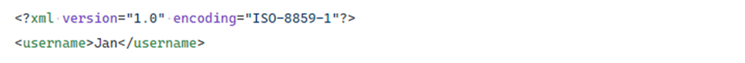
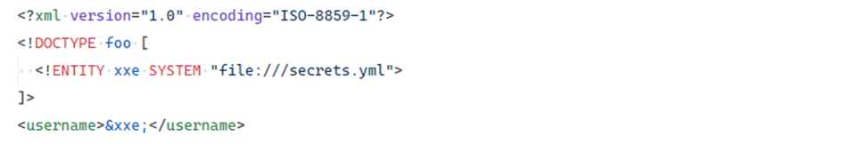
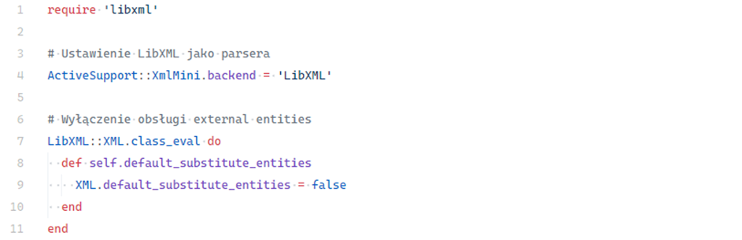

# XML External Entity (XXE)

## Description

**XML External Entity (XXE)** is an attack that exploits insecure configuration of XML parsers. It occurs when the parser allows processing of **external entities**, enabling automatic loading of resources from local files or remote URLs.

Although XXE may seem niche, many popular document formats—such as **Microsoft Word (DOCX)** or **Excel (XLSX)**—are internally based on XML. This makes XXE a real risk in financial systems, enterprise apps, and any scenario where users upload attachments or import data from files.

---

## Example

A simple, harmless XML document submitted by a user:

<!-- Figure 108: Example of a benign XML document -->

In an attack scenario, an adversary modifies the XML and adds an **external entity declaration** (`<!ENTITY ...>`), pointing to a local file on the server:

<!-- Figure 109: Malicious XML document attempting to read local secrets.yml -->

If the XML parser does not block external entity resolution, the content of `secrets.yml` will be loaded into the `username` variable. This results in unintentional disclosure of sensitive data.

---

## Impact

XXE attacks can have severe consequences:

* **Data disclosure** – loading contents of local files (e.g., `secrets.yml`, `.env`) leaks credentials, API keys, and sensitive configuration.
* **Denial-of-Service (DoS)** – via malicious entities (e.g., XML bombs) that cause excessive resource consumption and parser crashes.
* **SSRF (Server-Side Request Forgery)** – XXE may allow sending arbitrary HTTP requests from the server to internal services.

---

## Mitigation

### Avoid XML when possible

If XML parsing is not strictly required, disable it. Prefer **JSON** as a safer alternative.

### Use safe XML parsers

Rails by default uses **REXML**, which does not support external entities and is safe from XXE. Stick with the default parser unless there is a strong need to switch.

### Disable external entities in custom parsers

If another parser (e.g., LibXML) must be used, explicitly disable external entity resolution.

<!-- Figure 110: Example of XXE protection in Ruby on Rails -->

